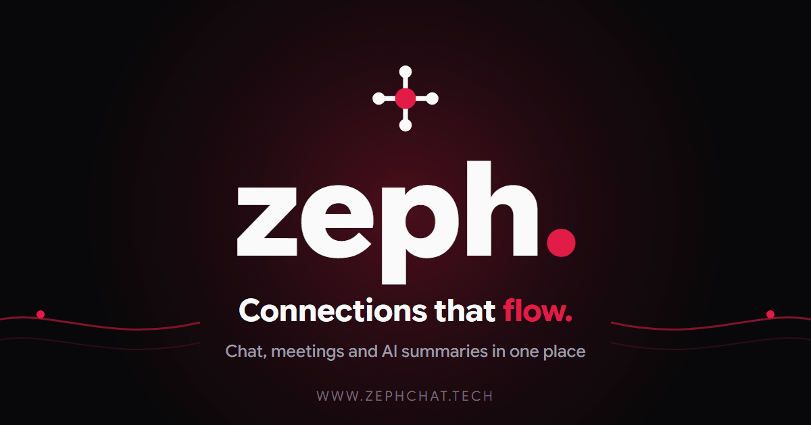
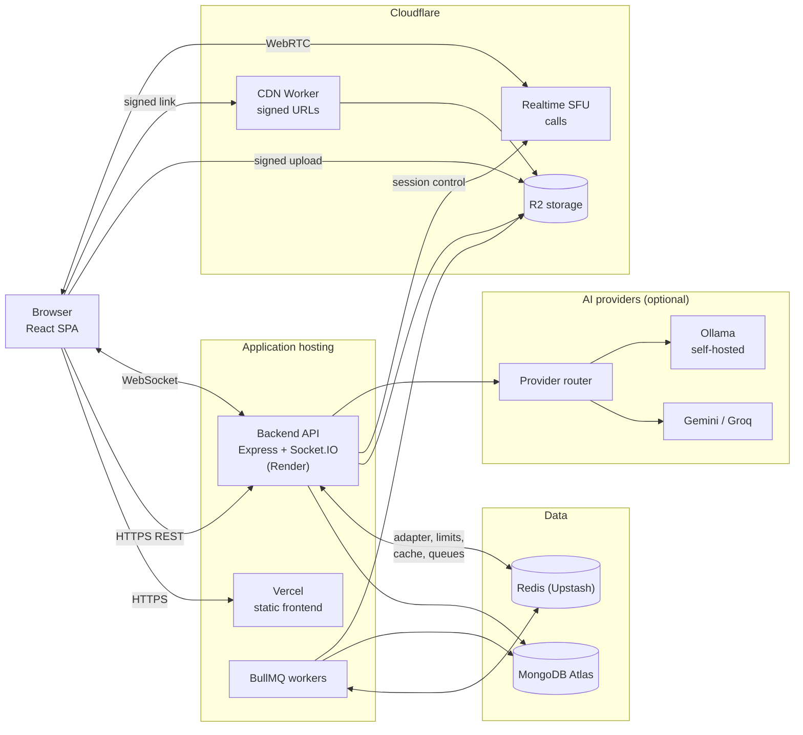
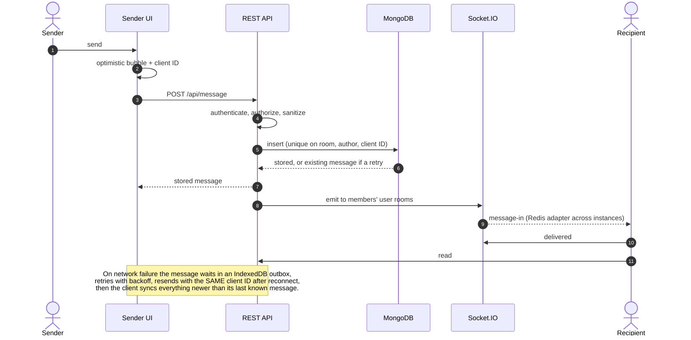
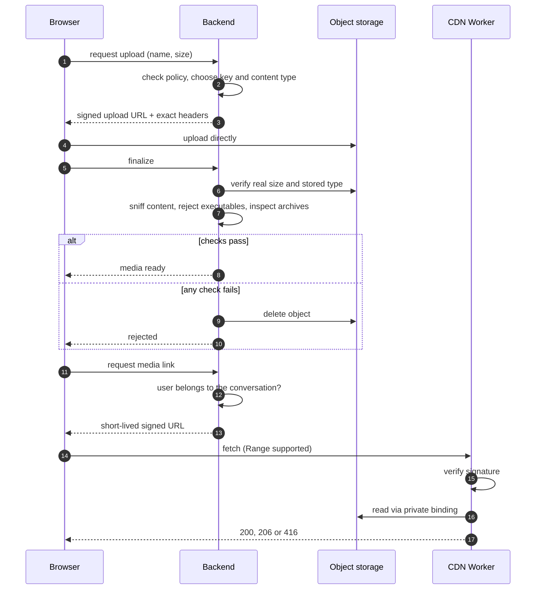
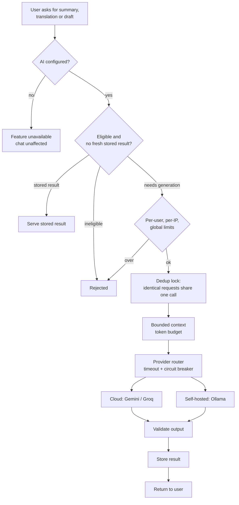
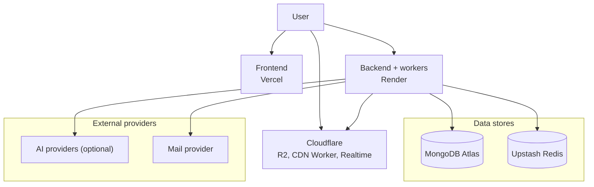

<p align="center">
  
</p>

# Zeph

**A real-time messaging, calling and AI-assisted collaboration platform, engineered for unreliable mobile networks.**

[Live Demo](https://www.zephchat.tech/) · [GitHub](https://github.com/GEARdHAX/zeph) · [Architecture](#architecture) · Demo Video _(coming soon)_

> **Attribution.** The original application layer (chat, calling and WebRTC foundations) is built on a commercial template ("Clover" by Honeyside, via CodeCanyon). Everything listed under [Key Engineering Highlights](#key-engineering-highlights) is original engineering work on top of that foundation: security hardening, the real-time architecture, Redis/BullMQ, the AI layer, the storage/CDN pipeline, Cloudflare-based calling, testing, CI, and the design-system migration. The full record of what changed and why is in [`DECISIONS.md`](DECISIONS.md).

---

## What is Zeph?

Zeph is a full-stack communication platform: direct messages and groups, voice/video meetings, file and media sharing, and an optional AI assistant that can summarize a conversation, translate a message, or draft a reply. It runs as a React single-page app talking to a Node.js/Express/Socket.IO backend backed by MongoDB and Redis.

It is built around one constraint that most chat demos ignore: **real networks are bad.** Phones drop to 2G, switch between Wi-Fi and cellular mid-send, and sit behind data caps. Zeph treats that as the normal case. Messages are idempotent and queued locally when offline, history is fetched with cursor pagination, heavy screens are lazy-loaded, uploads go straight to object storage, and AI is never required for anything core.

Zeph is a portfolio engineering project. It is deployed and usable at [zephchat.tech](https://www.zephchat.tech/), but it is not presented as having the scale of a commercial messenger. The goal is to show how the hard parts of such a product are designed, secured and tested.

## Why I Built It

I wanted a project where the interesting problems were real ones: delivering a message exactly once over a flaky connection, authorizing every read and write on a multi-user system, handling untrusted file uploads safely, keeping AI features cost-bounded and optional, and running video calls on a small budget. Starting from a working template let me spend my time on the engineering around it (the security model, the delivery guarantees, the storage pipeline, the test suite and the operational concerns) rather than on scaffolding.

---

## Key Engineering Highlights

1. **Idempotent, resilient message delivery.** Every outgoing message carries a client-generated ID enforced by a database uniqueness guarantee, so retries after a timeout can never create duplicates. A durable IndexedDB outbox holds unsent messages across reloads and flushes them on reconnect with backoff, and a resync call fills any gap after a disconnect.
2. **Layered security model.** Server-side session revocation, passkeys, a PIN/WebAuthn "private vault", risk-based step-up for sensitive actions, role-based group authorization, ownership checks on every media read, and a Redis-backed rate limiter that fails closed.
3. **Hardened upload pipeline.** Direct-to-object-storage uploads with server-signed headers, one source of truth for type/extension/size policy, content sniffing instead of trusting the browser, archive inspection, and server-generated storage keys. Verified with a test matrix covering all 56 supported file extensions.
4. **Signed-URL CDN on a Cloudflare Worker.** Private media is served through short-lived signed links with range-request support, correct download behaviour for risky types, and no direct storage exposure.
5. **Calls on Cloudflare Realtime.** An SFU-based calling engine selectable at runtime (Cloudflare Realtime by default, self-hosted mediasoup as an alternative), with a monthly usage guard to keep cost bounded. Measured live: a 4x increase in delivered pixels at the same stability.
6. **Governed, optional AI.** A provider-agnostic gateway (cloud or self-hosted model) with eligibility rules, per-user quotas, request de-duplication, bounded context, cached summaries and background jobs. The product works fully with AI switched off.
7. **Storage lifecycle correctness.** Deleting a message removes its stored file, with retries and a shared-media check, while the UI updates optimistically and rolls back if the server rejects the delete.

---

## Architecture

Five diagrams cover the core of the system. The full set (calls, rate limiting, trust boundaries, resilience, CI and more) lives in [`docs/architecture/`](docs/architecture/).

### 1. System architecture



_Legend:_ solid arrows are real calls; browsers talk to storage and the CDN only through server-signed requests; Redis holds coordination state, MongoDB is the system of record. Not shown because not active: end-to-end encryption, media edge caching, and the self-hosted mediasoup call option.

**Why this design?** Heavy bytes (uploads, downloads, call media) bypass the API server, so it spends its capacity on authorization and business logic. More in [`system-overview.md`](docs/architecture/system-overview.md).

### 2. Message flow (idempotent persistence, reliable recovery)



**Why this design?** Messages are persisted over HTTP, not trusted to a socket. A client ID plus a database uniqueness constraint makes retries idempotent, and Socket.IO only handles live propagation. The failure path and the offline flow are in [`messaging-flow.md`](docs/architecture/messaging-flow.md).

### 3. Secure media upload and delivery



**Why this design?** The browser is never trusted: type, size and key are decided or re-verified by the server, and storage is never exposed directly. Deletion lifecycle and CDN details: [`media-pipeline.md`](docs/architecture/media-pipeline.md). Edge caching is not yet active.

### 4. AI architecture



**Why this design?** Every cost and abuse control sits in front of the provider call, so no feature can bypass quotas or timeouts, and AI stays optional. Gemini can fall back to Groq when both are configured. Details, cost controls and the meeting pipeline: [`ai-architecture.md`](docs/architecture/ai-architecture.md).

### 5. Production infrastructure



CI is a verification pipeline (secret scan, tests, lint, audit, Docker smoke builds); it does not deploy. See [`infrastructure.md`](docs/architecture/infrastructure.md).

### More diagrams

| Topic | Document |
|---|---|
| System overview and data responsibilities | [`system-overview.md`](docs/architecture/system-overview.md) |
| Messaging and unreliable-network flows | [`messaging-flow.md`](docs/architecture/messaging-flow.md) |
| Socket.IO across instances | [`realtime-architecture.md`](docs/architecture/realtime-architecture.md) |
| Upload, CDN delivery, deletion lifecycle | [`media-pipeline.md`](docs/architecture/media-pipeline.md) |
| AI flow, cost governance, meeting AI | [`ai-architecture.md`](docs/architecture/ai-architecture.md) |
| Calls | [`calls-architecture.md`](docs/architecture/calls-architecture.md) |
| Auth, rate limiting, trust boundaries | [`security-architecture.md`](docs/architecture/security-architecture.md) |
| Background jobs, failure behaviour, performance mapping | [`resilience.md`](docs/architecture/resilience.md) |
| Infrastructure and CI | [`infrastructure.md`](docs/architecture/infrastructure.md) |

---

## Core Systems

### Realtime Messaging
- Socket.IO 4 with an authenticated handshake: a socket must present a valid token shortly after connecting or it is dropped, and sessions revoked on the server stop working on sockets as well as HTTP.
- Each user has a private socket room; conversation fan-out is computed from server-side membership, so clients cannot subscribe themselves to someone else's conversation.
- The Redis adapter lets multiple backend instances share events, with a single-process fallback when Redis is not configured.
- Delivery and read receipts, typing indicators and presence; message ordering relies on database IDs.
- Resync after reconnect and jump-to-message / search-around-message support.

### AI System
- Features: conversation summarization, translation, draft replies, message rewriting, titles and topics, and meeting summaries/transcription.
- Requests pass through a governed pipeline: eligibility checks (a summary is not run on a three-message chat), per-user and global quotas, a de-duplication lock so identical concurrent requests collapse into one job, and a hard input-token budget.
- A provider router supports Gemini and Groq in the cloud and Ollama as a self-hosted option, with a circuit breaker so a failing provider does not stall users. With no provider configured, AI endpoints are simply off.
- Summaries are stored and reused until the conversation has changed enough to justify a refresh.
- See [`docs/ZEPH-AI-ARCHITECTURE.md`](docs/ZEPH-AI-ARCHITECTURE.md) and [`docs/AI-STRATEGY.md`](docs/AI-STRATEGY.md).

### Authentication & Security
- Argon2 password hashing, server-tracked sessions that can be revoked per device, passkey (WebAuthn) sign-in, and a Private Vault that gates hidden conversations behind a PIN or passkey.
- Sensitive actions (changing a password, managing sessions, moderation) pass through a risk engine that can allow, require step-up, or deny.
- Authorization is enforced server-side per resource: DM membership, group roles with capability checks, and an admin privacy boundary.
- Details in [Security](#security).

### Database & Caching
- MongoDB (Mongoose) with indexes designed around the access patterns: conversation lookup, message history by cursor, per-room de-duplication, TTL indexes for short-lived tokens and invites.
- A uniqueness constraint prevents duplicate direct-message rooms.
- Redis is used for the Socket.IO adapter, rate limiting, AI quota and de-duplication state, caching, and job queues.

### File/Media System
- Seven media categories (image, video, audio, PDF, document, archive, text) governed by a single policy: extension, MIME type, size limit and security level are defined in one place and mirrored (with a test that fails if the mirror drifts) in the frontend.
- Flow: the client requests an upload slot, uploads directly to object storage using headers the server signed, then asks the server to finalize. Finalization re-checks the real stored size and content type, sniffs the file's actual bytes, inspects archives, generates image thumbnails, and deletes anything that fails.
- Videos can be trimmed and muted client-side before sending, with a fast path that uploads untouched clips as-is.
- Downloads and previews are served through a Cloudflare Worker using short-lived signed links with range-request support. Document, archive and text types are always served as downloads rather than rendered.
- Deleting a message for everyone detaches its media, then a background job removes the stored objects.
- See [`docs/CDN-ARCHITECTURE.md`](docs/CDN-ARCHITECTURE.md).

### Notifications
- In-app toasts and previews driven by socket events, unread/receipt state per message, and transactional email (verification, password reset, invites) sent through a mail provider's HTTP API from a queued outbox.

### Network & Performance
- Cursor pagination for message history, route-level code splitting (admin, media viewers, editors, meetings load on demand), direct-to-storage uploads that bypass the application server, small payloads, and compression.
- Optimistic UI for sending and deleting, debounced typing/search requests, and retry with backoff.
- Call video is capped by resolution and bitrate to protect both user data plans and platform cost.

---

## Performance

Numbers below come from the project's own measurements and are labelled by how they were taken. None are production capacity claims.

**Live measurement (real Cloudflare Realtime, headless Chromium with a synthetic camera, one machine, single-digit runs)**

| Change | Before | After |
|---|---|---|
| Delivered call video | 640x360 at ~190 kbps | 1280x720 at ~20 fps, ~640-660 kbps |
| Camera / mic / screen off-on cycles | - | 9 of 9 delivered |
| 4 participants x 3 tracks | - | all tracks received |
| Re-enabling a track | 0.7-1.1 s | 0.6-0.8 s |

Source: [`docs/CALL-QUALITY-METRICS.md`](docs/CALL-QUALITY-METRICS.md), [`docs/CALL-FIXES-LOG.md`](docs/CALL-FIXES-LOG.md). Caveats: synthetic video, not a two-real-device test.

**Local benchmarks (developer laptop, local MongoDB/Redis, single Node process, single run, not production)**

| Measurement | Result |
|---|---|
| Room list, 10 / 50 / 100 concurrent requests | p50 55 / 267 / 506 ms |
| Socket.IO, 500 concurrent clients | 500 of 500 connected, no errors; connect+auth p50 596 ms |
| Backend memory under a burst | ~105 MB rising to ~226 MB peak |
| User-level query | full scan of 3,005 documents became an index lookup examining 1 |
| History pagination over 5,000 messages | 50 documents examined per page |

These were taken before the current distributed rate limiter replaced the original in-process one, so they describe raw throughput, not current limiting behaviour. Source: [`docs/PHASE8-CAPACITY-REPORT.md`](docs/PHASE8-CAPACITY-REPORT.md) (kept as a historical record).

**AI pipeline (local, against a mock model server with a fixed 300 ms delay)**

| Scenario | Result |
|---|---|
| 10 identical concurrent summary requests | collapsed into 1 model call |
| Cached summary read | p50 ~60 ms |
| Per-user burst of 15 requests | 5 accepted, the rest rejected in a few milliseconds |

Real model latency was not measured. Source: [`docs/ZEPH-AI-ARCHITECTURE.md`](docs/ZEPH-AI-ARCHITECTURE.md).

---

## Security

Security mechanisms are described here by purpose. Detailed findings and operational notes are kept in internal documentation.

| Area | Mechanism |
|---|---|
| Authentication | Argon2 password hashing; passkey sign-in; per-device sessions that can be revoked server-side and are re-checked on sockets |
| Sensitive actions | Risk-based decision (allow / step-up / deny) that fails closed; AI contributes only an advisory, bounded signal |
| Authorization | Server-side checks on every read and write: conversation membership, group role capabilities, admin privacy boundary, media access tied to the referencing conversation |
| Abuse prevention | Distributed Redis token-bucket rate limiting across all route groups; it denies requests rather than allowing them when its backing store is unavailable |
| Input handling | Server-side validation and sanitization; payload and file size limits |
| Uploads | Server-chosen storage keys, signed upload headers, content sniffing, executable rejection, archive inspection, real-size verification, ownership checks, and poster/thumbnail validation |
| Media delivery | Short-lived signed links, no direct storage exposure, safe download behaviour for risky types |
| Transport & headers | HTTPS/WSS, hardened HTTP headers, origin allow-list |
| Secrets & logging | Structured logs with credential redaction; secret scanning and dependency audit in CI |
| Audit | Security events are recorded for authentication, authorization denials and rate-limit triggers |

**Encryption.** Traffic is encrypted in transit (HTTPS/WSS). Zeph is **not** end-to-end encrypted: message content is readable by the server. A design for end-to-end encryption exists in [`docs/E2EE-THREAT-MODEL.md`](docs/E2EE-THREAT-MODEL.md) but is not implemented, and the product does not claim it.

For security policy and reporting, see [`SECURITY.md`](SECURITY.md).

---

## AI & Business Logic

AI exists to reduce reading and writing effort in a messenger, not as a gimmick:

- **Summaries** let someone catch up on a long group thread in seconds.
- **Translation** removes a language barrier inside a conversation.
- **Draft replies and rewriting** help compose messages faster.
- **Meeting summaries** turn recorded audio into notes.

Business and cost controls are part of the design: AI is opt-in per action (never automatic), quota-limited per user, de-duplicated, bounded in context size, and cached. A self-hosted model option exists so conversations do not have to leave the deployment. Because conversation text is sent to the configured provider, cloud providers should only be enabled where that is acceptable.

---

## Scalability & Reliability

**Implemented today**
- Stateless API behind a Redis-backed socket adapter, so more instances can be added for realtime fan-out.
- Background work (cleanup, AI, analysis) runs in BullMQ workers with retries.
- Graceful shutdown that drains HTTP, sockets, workers and database connections; liveness and readiness health checks.
- Idempotent writes and resync, so network failures degrade to retries rather than data loss.
- Provider circuit breakers, request timeouts, usage guards on paid services, and graceful behaviour when optional services (AI, mail, storage backend) are not configured.
- Heavy assets bypass the application server (direct uploads, CDN delivery).

**Not yet implemented (honest roadmap)**
- Cross-instance presence and call state, automated database backups, metrics and distributed tracing, a content-security policy, and load testing beyond a single node. Zeph has been measured at the scale of hundreds of concurrent local connections, not millions of users.

---

## Tech Stack

| Responsibility | Technology |
|---|---|
| Frontend | React 18, Vite, Redux, Tailwind CSS v4, shadcn/ui (Radix), Lucide icons, React Query (mutations) |
| Backend | Node.js 20+, Express 4, Socket.IO 4, Mongoose |
| Data | MongoDB, Redis |
| Queues & jobs | BullMQ |
| Auth | Argon2, JWT sessions, WebAuthn passkeys (SimpleWebAuthn) |
| Media | Cloudflare R2 (S3-compatible), Cloudflare Worker CDN, sharp |
| Calls | Cloudflare Realtime SFU (default), mediasoup (self-hosted option), WebRTC |
| AI | Groq, Gemini, Ollama behind a provider router |
| Testing | Jest, Supertest, mongodb-memory-server, Vitest, Testing Library, Node test runner |
| CI/CD & hosting | GitHub Actions, Vercel (frontend), Render (backend), MongoDB Atlas, Upstash Redis, Docker |

---

## Engineering Decisions & Trade-offs

Every significant decision is recorded in [`DECISIONS.md`](DECISIONS.md). A few that shaped the project:

- **Idempotency over exactly-once transport.** HTTP + a unique constraint is simpler and more robust than building acknowledgement protocols on sockets. Trade-off: sends are request/response, not a socket push.
- **Cloudflare Realtime instead of self-hosting an SFU.** The host used for the API cannot expose the wide UDP port range an SFU needs. A managed SFU removed that constraint at the cost of a usage cap, which is guarded. The self-hosted engine remains behind a switch.
- **Direct-to-storage uploads.** Saves server bandwidth and memory, at the cost of a two-step flow that needs careful server-side re-verification at finalization.
- **Sniff the bytes, don't trust the browser.** Slightly more work per upload; removes a whole class of disguised-file problems.
- **Fail closed on rate limiting.** Protects the platform when Redis is down; the trade-off is reduced availability in that failure mode.
- **Optional AI with a provider abstraction.** Costs some abstraction code, but keeps vendor lock-in, cost and privacy under control.
- **Tailwind + shadcn/ui as the only styling system.** One consistent design language across chat, auth, settings, meetings and admin. See [`docs/CHITCX-DESIGN-SYSTEM-MIGRATION.md`](docs/CHITCX-DESIGN-SYSTEM-MIGRATION.md).
- **Honest scope.** E2EE, backups and tracing are documented as gaps rather than hidden.

---

## Testing

- **Backend:** approximately 1,450 test cases across ~146 files (Jest, Supertest, an in-memory MongoDB per test file). Coverage includes authentication and sessions, authorization, rate limiting, socket auth and the Redis adapter, uploads, the CDN signing, AI governance, and the calls engine.
- **Media matrix:** a table-driven suite exercises every supported file extension through presign, upload, finalization, serving metadata and rejection paths, plus tests that the frontend and backend media policies cannot drift apart.
- **Frontend:** approximately 650 test cases across ~78 files (Vitest + Testing Library), including the upload client, video editor, optimistic delete with rollback, the offline outbox and the calls engine.
- **CDN Worker:** a dedicated suite for signature verification, range handling and header behaviour.
- **CI:** every push runs secret scanning, formatting, linting, dependency audit, the backend and frontend suites, and Docker build smoke tests.
- **Live checks:** scripts exist to verify storage, CDN and call connectivity against real services.

Counts are static counts of test cases, not a run report. A small number of frontend tests in the meeting recorder component are known to fail on label wording. See [`docs/TESTING-STRATEGY.md`](docs/TESTING-STRATEGY.md) for the original strategy (parts predate the current suite).

---

## Deployment & Infrastructure

| Layer | Where |
|---|---|
| Frontend | Vercel (static SPA with long-lived caching for hashed assets) |
| Backend API + sockets | Render |
| Database | MongoDB Atlas |
| Redis / queues | Upstash Redis |
| Media storage | Cloudflare R2 |
| Media delivery | Cloudflare Worker (signed URLs, range requests) |
| Calls | Cloudflare Realtime |
| Mail | Transactional email provider over HTTP |
| CI | GitHub Actions (gitleaks, tests, lint, audit, Docker smoke builds) |

Notes: edge caching of media requires the domain to sit on Cloudflare DNS and is a planned step. Cost is deliberately kept modest and bounded (see [`docs/COST-MODEL.md`](docs/COST-MODEL.md) for the original cost reasoning, partly superseded by [`DECISIONS.md`](DECISIONS.md)).

---

## Project Structure

```
zeph/
├── backend/            Express + Socket.IO API, models, routes, queues, AI, calls
│   ├── src/routes/       HTTP endpoints
│   ├── src/models/       Mongoose schemas
│   ├── src/queues/       BullMQ queues and workers
│   ├── src/ai/           AI gateway, providers, quota, dedup
│   ├── src/calls/        Call engines (Cloudflare Realtime / shared lifecycle)
│   ├── src/mediasoup/    Self-hosted SFU option
│   ├── loadtest/         Load and call-quality harnesses
│   └── test/             Jest suites
├── frontend/           React SPA (Vite)
│   ├── src/features/     Conversation, meetings, settings, admin
│   ├── src/components/ui shadcn/ui primitives
│   ├── src/actions/      API and socket actions
│   └── src/lib/          Outbox, media policy, call engine, hooks
├── cdn-worker/         Cloudflare Worker for signed media delivery
├── ebpf-sensor/        Optional Linux network telemetry sensor
├── docs/               Design notes, audits, measurements
├── docker-compose.yml  Local development stack
└── DECISIONS.md        Engineering decision log
```

`documentation/`, `scripts/` and `launcher` are leftovers from the original template and are not part of the Zeph workflow.

---

## Challenges & Solutions

1. **Browser uploads to object storage failing with a bad-request error.** The browser showed a CORS-style failure, but the real cause was the HTTP client library attaching the user's login credential to a cross-origin storage request, which the storage service rejects. Fix: upload with a plain request that sends only the headers the server signed, and bind the content type, cache and disposition headers into the signature. Proven with a real-browser reproduction and covered by regression tests. See [`docs/PROBLEMS-AND-SOLUTIONS.md`](docs/PROBLEMS-AND-SOLUTIONS.md).
2. **Video and screen share not reaching other participants.** A single WebRTC session could not both publish and receive reliably. Fix: separate send and receive sessions per participant with a fresh session on each toggle, verified live with 4 participants x 3 tracks. See [`docs/CALL-FIXES-LOG.md`](docs/CALL-FIXES-LOG.md).
3. **Messages on unstable networks.** Retries created duplicates and reconnects created gaps. Fix: client IDs with a database uniqueness guarantee, a durable local outbox, and a server resync call.
4. **Trusting client-supplied upload metadata.** Type, size and thumbnail references from the browser were treated too generously. Fix: derive the type from the validated extension, re-verify the stored size and bytes at finalization, and validate any companion thumbnail against the uploader's own object.
5. **Deleting media for real.** Deleting a message left its file in storage. Fix: detach the reference first (which immediately stops serving it), skip the purge if another message still uses it, then remove the objects in a retried background job, with an optimistic UI that rolls back if the request fails.

---

## Future Improvements

- End-to-end encryption for direct messages, following the documented threat model.
- Automated database backups and a tested restore procedure.
- Metrics, distributed tracing and alerting.
- A content-security policy and continued hardening of token lifecycle and AI prompt handling.
- Cross-instance presence and call state.
- Edge caching for media after moving DNS to Cloudflare.
- A real two-device call test and broader multi-node load tests.
- Upload cancel/retry controls and richer previews for non-image files.

---

## Getting Started

**Prerequisites:** Node.js 20+ (22 for the frontend), MongoDB, Redis. Docker is optional but simplest.

**Option A: Docker**

```bash
cp backend/.env.example backend/.env
cp frontend/.env.example frontend/.env
# edit backend/.env: set AUTH_SECRET and the ROOT_USER_* admin account
docker compose up --build
```

The app is served on `http://localhost:5173`, the API on port 4002.

**Option B: Manual**

```bash
# terminal 1
cd backend && npm install && npm start

# terminal 2
cd frontend && npm install && npm run dev
```

**Tests**

```bash
cd backend && npm test
cd frontend && npm test
cd cdn-worker && npm test
```

The admin account is created from the `ROOT_USER_*` settings on first start.

---

## Environment Variables

Copy `backend/.env.example` and `frontend/.env.example`; the examples list every option. Never commit real values.

| Group | Purpose | Required? |
|---|---|---|
| Core | `AUTH_SECRET`, MongoDB connection, `ROOT_USER_*` admin account, `PORT`, `CORS_ORIGIN` | Yes |
| Redis | `REDIS_URL` for the socket adapter, rate limiting, queues, caching | Effectively yes (rate limiting needs it) |
| Object storage / CDN | Storage endpoint and credentials, CDN base URL and signing key | Optional (falls back to local disk) |
| Calls | `CALL_BACKEND` and the provider credentials for the chosen engine, usage caps | Optional |
| AI | `AI_PROVIDER`, provider keys or local model URL, token/quota limits | Optional (AI is off by default) |
| Mail | Mail provider credentials | Optional |
| Rate limits | Per-policy capacity and refill overrides | Optional |
| Security extras | Threat-intelligence and sensor settings | Optional |

---

## API / Architecture Documentation

| Topic | Document |
|---|---|
| Engineering decisions | [`DECISIONS.md`](DECISIONS.md) |
| New features (calls, meetings, storage, CDN) | [`docs/NEW-FEATURES.md`](docs/NEW-FEATURES.md) |
| AI architecture and strategy | [`docs/ZEPH-AI-ARCHITECTURE.md`](docs/ZEPH-AI-ARCHITECTURE.md), [`docs/AI-STRATEGY.md`](docs/AI-STRATEGY.md) |
| AI security risk engine | [`docs/PHASE6-AI-SECURITY-RISK-ENGINE.md`](docs/PHASE6-AI-SECURITY-RISK-ENGINE.md) |
| CDN and media delivery | [`docs/CDN-ARCHITECTURE.md`](docs/CDN-ARCHITECTURE.md) |
| Rate limiting design | [`docs/RATE-LIMITING.md`](docs/RATE-LIMITING.md) |
| Call quality and fixes | [`docs/CALL-QUALITY-METRICS.md`](docs/CALL-QUALITY-METRICS.md), [`docs/CALL-FIXES-LOG.md`](docs/CALL-FIXES-LOG.md) |
| Problems and solutions | [`docs/PROBLEMS-AND-SOLUTIONS.md`](docs/PROBLEMS-AND-SOLUTIONS.md) |
| Capacity measurements (historical) | [`docs/PHASE8-CAPACITY-REPORT.md`](docs/PHASE8-CAPACITY-REPORT.md) |
| E2EE design (not implemented) | [`docs/E2EE-THREAT-MODEL.md`](docs/E2EE-THREAT-MODEL.md) |
| Security policy | [`SECURITY.md`](SECURITY.md) |
| Developer notes | [`README.dev.md`](README.dev.md) |

---

## Screenshots / Demo

> Screenshots and a demo video are coming soon. Place images in `docs/screenshots/` and reference them here.

| Chat | Video call | AI summary | Private vault |
|---|---|---|---|
| _coming soon_ | _coming soon_ | _coming soon_ | _coming soon_ |

Try it live: **[zephchat.tech](https://www.zephchat.tech/)**

---

## Author

**Adarsh Arya** ([@GEARdHAX](https://github.com/GEARdHAX))

- GitHub: [github.com/GEARdHAX](https://github.com/GEARdHAX)
- LinkedIn: _add link_
- Email: _add address_
