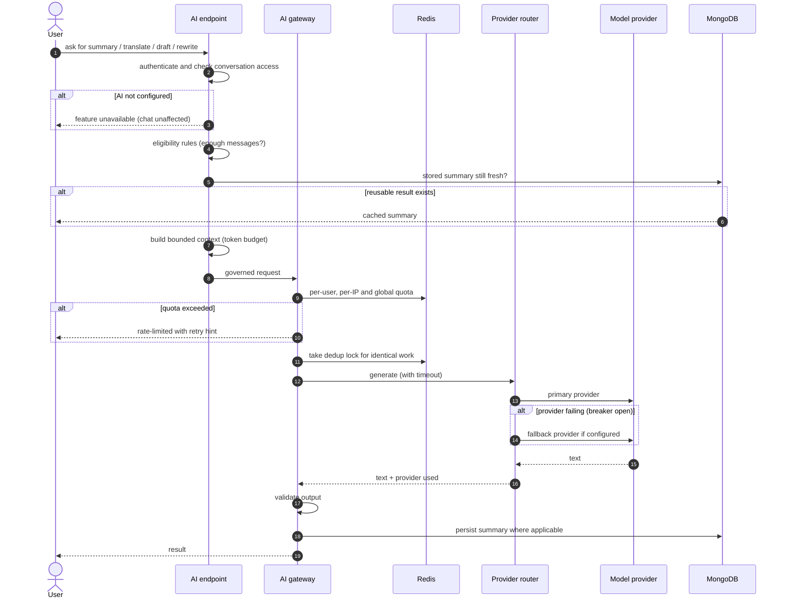
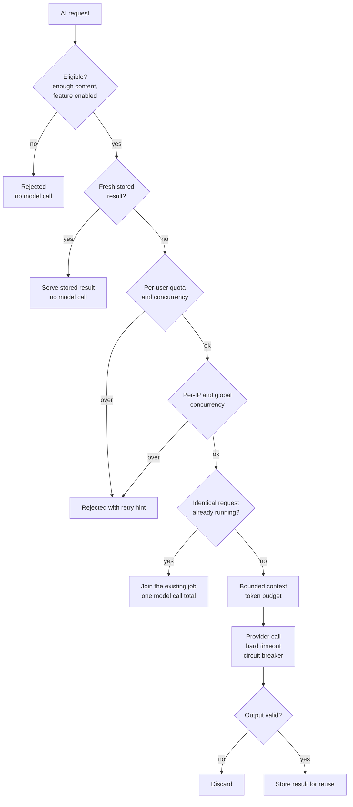
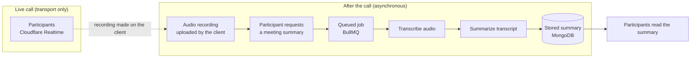

# AI Architecture

AI in Zeph is optional and user-triggered. Core messaging never depends on it.

## 9. AI request flow

**Cloud vs self-hosted.** Gemini and Groq are cloud providers: the conversation text sent for a request leaves the deployment. Ollama is a self-hosted option that keeps it local. With the provider set to none (the default) every AI endpoint reports unavailable and the rest of the product is unchanged.

**Fallback, precisely.** When the primary is Gemini and a Groq key is configured, Gemini failures fall back to Groq, and a per-provider circuit breaker skips an unhealthy provider for a cooldown period. Groq-only and Ollama-only setups have no fallback; a failure returns "unavailable".

**Why this design?** Everything that costs money or can be abused sits in one governed gateway, so individual features (summary, translate, draft) cannot bypass quotas or timeouts. The provider router isolates vendor specifics, which keeps cost, privacy and lock-in decisions configurable.

---

## 10. Cost and governance controls

| Control | Effect |
|---|---|
| Eligibility minimums | Avoids paying to summarize trivial conversations |
| Stored summaries | Repeated requests are served without a model call until the conversation changes enough |
| Per-user / per-IP / global limits | Bounds spend from any one account, address, or a burst |
| Dedup lock | Concurrent identical requests collapse into a single model call |
| Token budget | Caps input size per call |
| Timeout + circuit breaker | A slow or failing provider cannot stall users or burn retries |
| Explicit user action | Nothing runs in the background without a user asking |

Measured against a mock model (not a real provider): 10 identical concurrent summary requests produced 1 model call. See [`../ZEPH-AI-ARCHITECTURE.md`](../ZEPH-AI-ARCHITECTURE.md).

**Why this design?** An LLM call is the one place where a bug or a malicious user can turn directly into a bill. Putting every control before the provider call, and making AI explicit and optional, keeps cost predictable and the product usable when AI is off.

---

## 13. Meeting AI pipeline

There is **no realtime AI transcription** during a call. Recording and summarization happen after the call, only when a participant asks, and a failure leaves the meeting itself unaffected.

**Why this design?** Keeping AI out of the live media path means it cannot affect call quality or cost, and queueing it with retries makes slow transcription a background concern.
