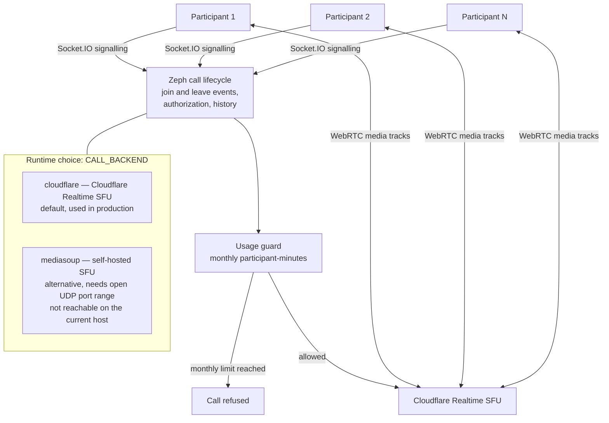
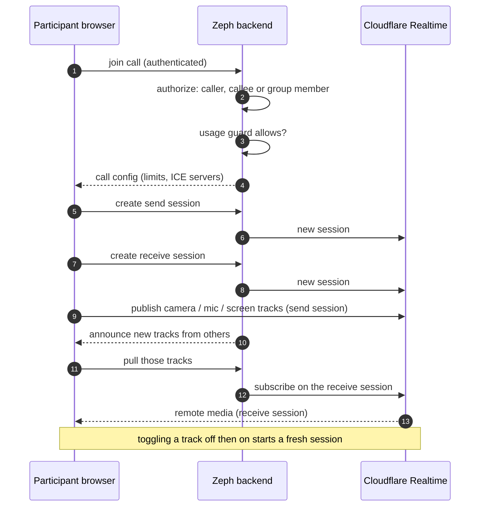

# Calls Architecture

## 12. Video and audio calls

### Sessions per participant

| Aspect | Detail |
|---|---|
| Separate send and receive sessions | Publishing and subscribing use different sessions, which fixed video and screen share not reaching other participants |
| Quality caps | Video capped by resolution and bitrate; participant count capped |
| Usage guard | Participant-minutes tracked monthly in Redis; calls are refused past the limit, which bounds cost |
| Authorization | Joining re-runs the same conversation/meeting authorization as other endpoints |
| History | Call sessions and timeline events are recorded |

Measured (live Cloudflare, synthetic camera, one machine): delivered video went from 640x360 at about 190 kbps to 1280x720 at about 640-660 kbps; 9 of 9 camera/mic/screen off-on cycles delivered. See [`../CALL-QUALITY-METRICS.md`](../CALL-QUALITY-METRICS.md). A test across two real devices is still pending.

**Why this design?** An SFU forwards each participant's media instead of mixing or meshing it, which keeps client bandwidth reasonable as participants join. The host running the API cannot expose the wide UDP range a self-hosted SFU needs, so the managed SFU is the production path and mediasoup stays available behind the same signalling layer.
