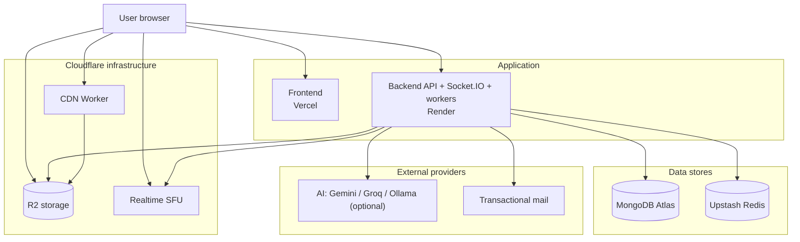
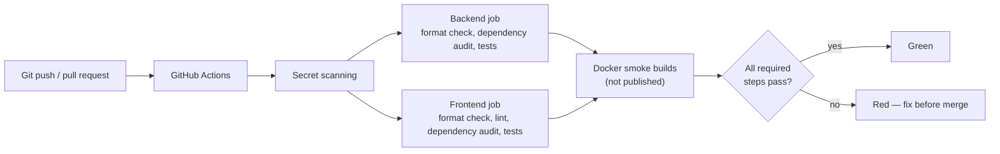

# Infrastructure and CI

## 17. Production infrastructure

Edge caching of media is not active yet (planned with a DNS move to Cloudflare). Ollama, when used, is self-hosted and not part of the managed footprint above.

**Why this design?** Managed free/low-cost services keep recurring cost small and deliberate, and the only components that need special network access (calls, bulk media) are delegated to Cloudflare, which the API host cannot provide.

---

## 16. CI / verification

This is a **verification** pipeline. There is no automated production deployment step in CI; hosting platforms deploy separately.

The dependency audits are reported but do not block the build. The CDN Worker's own tests are run locally rather than in this workflow.

**Why this design?** Secret scanning gates everything else so a leaked credential is caught before tests even matter, and the Docker smoke build verifies the images still assemble without publishing anything.
