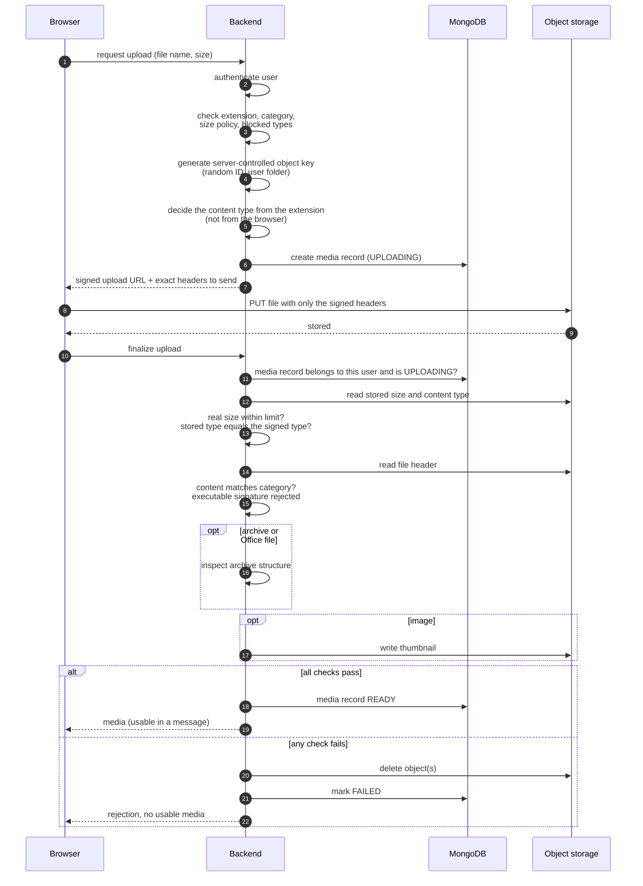
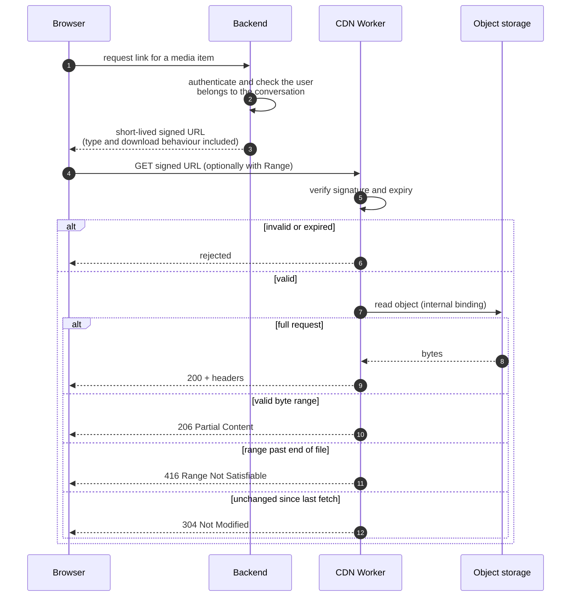
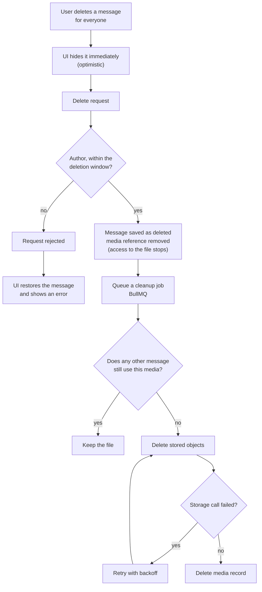

# Media Pipeline

Upload, delivery and deletion of attachments. The browser is never trusted: it proposes a file, the server decides.

## 6. Secure upload flow

**What the browser is not trusted for:** file type, file size, extension, the storage key, ownership, and any thumbnail reference it supplies. Each is derived or re-verified by the server.

**Why this design?** Direct-to-storage upload keeps large files off the application server. The cost is that the server never sees the bytes in transit, so it re-checks the stored object at finalization before anything becomes available. Binding the content headers into the signature means a client cannot upload under a different type than the one the server approved.

---

## 7. Media delivery

| Behaviour | Detail |
|---|---|
| No direct storage exposure | The storage bucket is private; only the Worker reads it, and only for valid signed links |
| Range / video seeking | Single byte ranges are served as 206; unsatisfiable ranges get 416; malformed range headers fall back to a full response |
| HEAD and conditional requests | Supported (headers without body, 304) |
| Download-only types | Documents, archives and text files are always served as attachments, never rendered inline |
| Cache headers | Private media is not publicly cached; public avatars are cacheable |

**Edge caching status.** Responses carry cache headers, but edge caching of media is **not yet active**: it requires the domain to be on Cloudflare DNS, which is a planned step.

**Why this design?** Authorization stays in the main backend (it knows about conversations), while byte-serving is offloaded to a Worker next to the storage. Signed, expiring links let the Worker validate requests without calling back to the backend.

---

## 8. Media deletion lifecycle

Deleting an entire one-to-one conversation runs the same cleanup for each attachment in it. Deleting a message **for me only** hides it for that user and never touches the file.

**Why this design?** The reference is detached before the file is removed, so access stops immediately even if storage is slow or failing. Deletion of the bytes is a retried background job, so a transient storage error never fails the user's delete, and the shared-media check prevents removing a file another message still needs. The optimistic UI means the interface feels instant, with a rollback if the server rejects the request.
