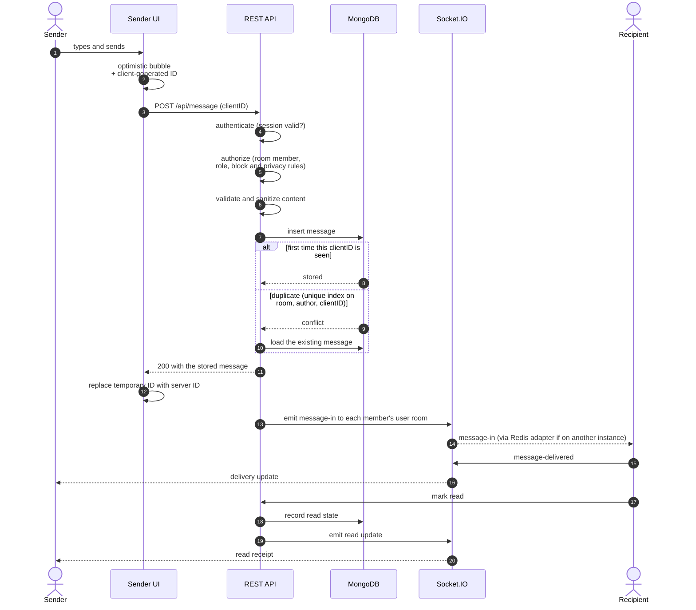
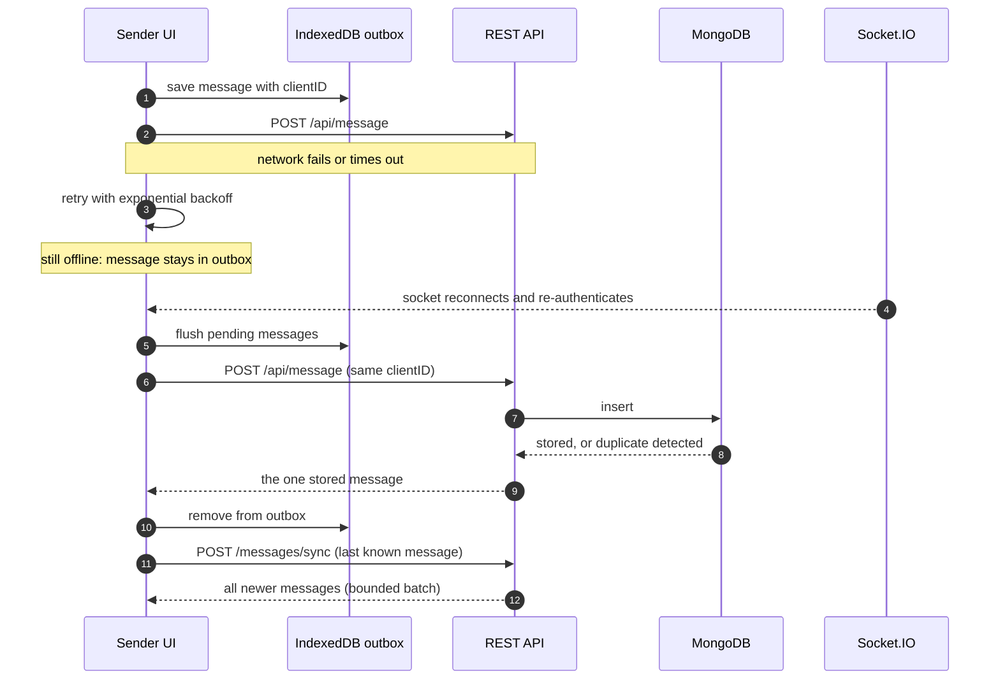
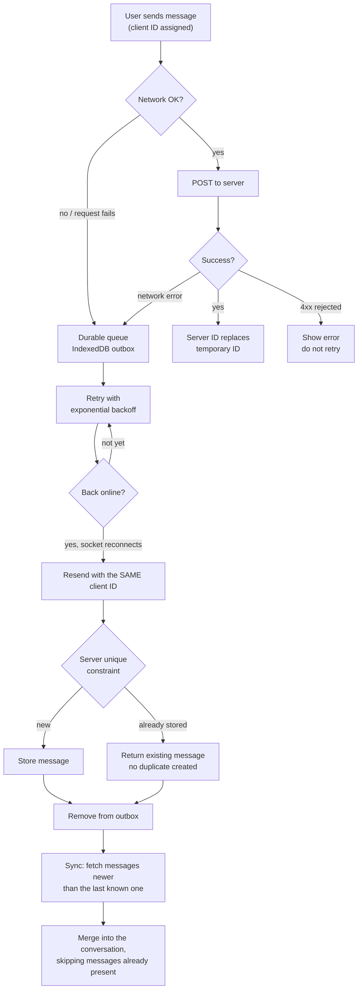

# Messaging Flow

How a message gets from one user to another, and how Zeph recovers when the network misbehaves.

Terminology: Zeph provides **idempotent message persistence** and **reliable recovery across reconnects**. It does not claim exactly-once network delivery.

## 2. End-to-end message flow

### Failure path

**Why this design?** Zeph persists messages over HTTP rather than treating Socket.IO as the source of truth. A client-generated ID combined with a database uniqueness constraint makes retries idempotent, so the same message sent twice is stored once. Socket.IO is responsible only for realtime propagation. This separates durable state from live delivery and lets the client recover anything it missed by asking the server for messages newer than the last one it knows.

---

## 3. Unreliable-network flow

**Engineering properties**

| Property | How it is achieved |
|---|---|
| Durable client-side queue | Unsent messages are written to IndexedDB, so they survive tab reloads and crashes |
| Retry | Exponential backoff for transient failures; client errors (4xx) are surfaced instead of retried |
| Idempotency | Same client ID on every attempt plus a database uniqueness constraint |
| Reconnect recovery | The outbox is flushed every time the socket authenticates |
| Synchronization | After reconnect the client requests everything newer than its last known message and merges without duplicating |

**Scope.** The outbox holds text messages. Media uploads are not queued offline.

**Why this design?** Mobile connections fail in the middle of requests, so a client often cannot tell whether the server received a message. Making the write idempotent turns that ambiguity into a safe retry instead of a data problem, and a durable queue means a user closing the tab does not lose what they typed.
