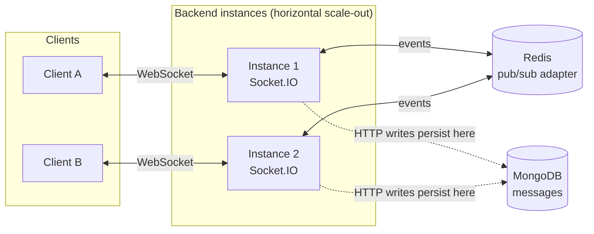
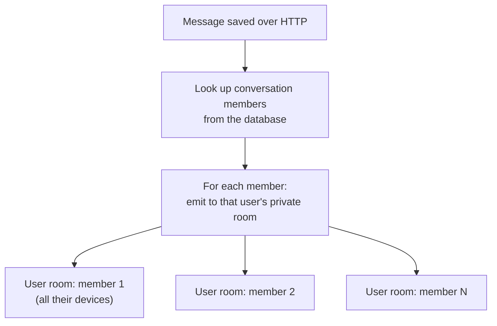

# Realtime Architecture

## 11. Socket.IO across multiple backend instances

### Rooms and fan-out

| Concern | Who handles it |
|---|---|
| Durable message storage | HTTP request to the API, written to MongoDB |
| Live propagation to browsers | Socket.IO events emitted after the write |
| Delivering events across instances | Redis adapter (pub/sub only; it does **not** store message history) |
| Who receives an event | Server-side membership lookup; clients cannot subscribe themselves to other people's conversations |
| Socket identity | Client must authenticate shortly after connecting; revoked sessions are refused |

**Current limits (honest scope).** Presence state is kept per backend process and is not yet shared across instances. Without Redis, Socket.IO falls back to single-instance behaviour.

**Why this design?** Each user joins one private room keyed by their own ID. Fan-out is then a loop over trusted, database-derived members, which avoids per-conversation room bookkeeping and removes a class of authorization mistakes. The Redis adapter lets additional instances be added without changing that logic, and because Redis only relays events, losing it never loses messages.
