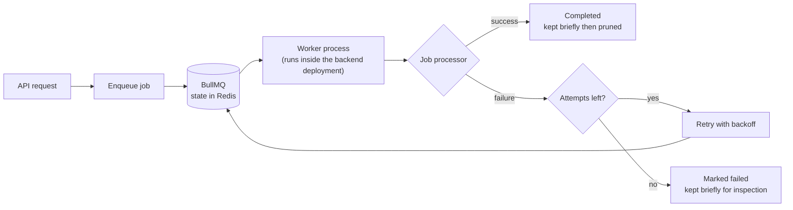
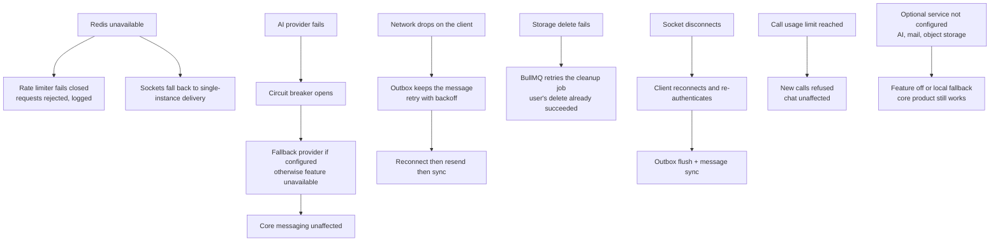
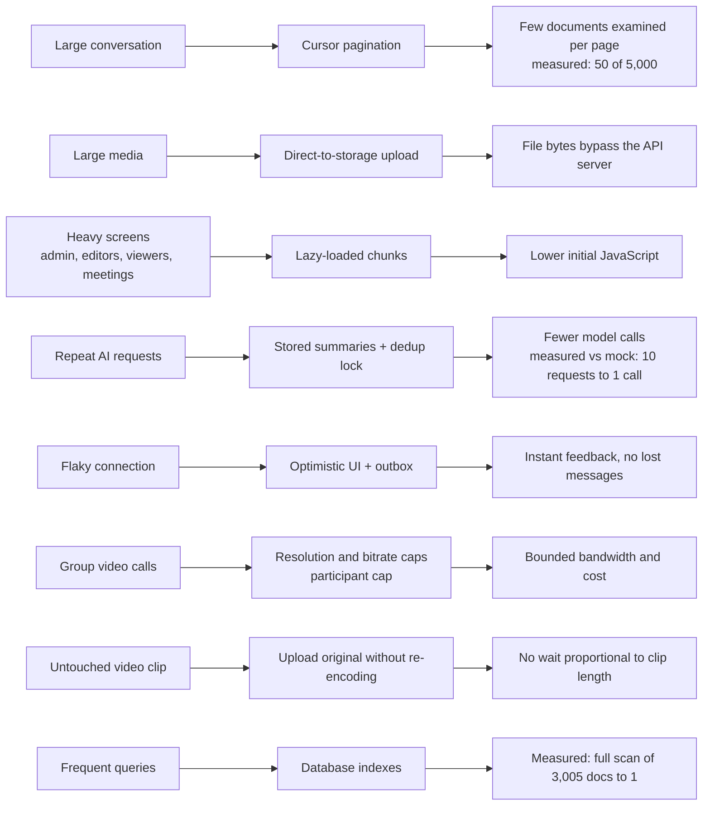

# Resilience and Performance

## 15. Background jobs

| Queue | Purpose |
|---|---|
| Media cleanup | Remove stored files after a message or conversation is deleted |
| Group cleanup | Purge a deleted group's data after a delay |
| AI summary | Conversation summaries |
| Meeting AI | Transcribe and summarize meetings |
| Security analysis | Advisory AI analysis of security events |

Jobs are retried a limited number of times with backoff and are pruned after a retention window. There is no separate dead-letter queue; exhausted jobs remain visible as failed for a limited time. Without Redis, media cleanup runs in-process on a best-effort basis and other queues are inactive.

---

## 18. Behaviour when dependencies fail

Every arrow above corresponds to implemented behaviour. Things Zeph does **not** yet do: automatic database failover, automated backups, cross-instance presence, metrics and tracing.

---

## 20. How engineering decisions map to performance

Only measured results are quoted with numbers; the others are design properties. Measurements are from local runs (see the README performance section); no production capacity is claimed.
