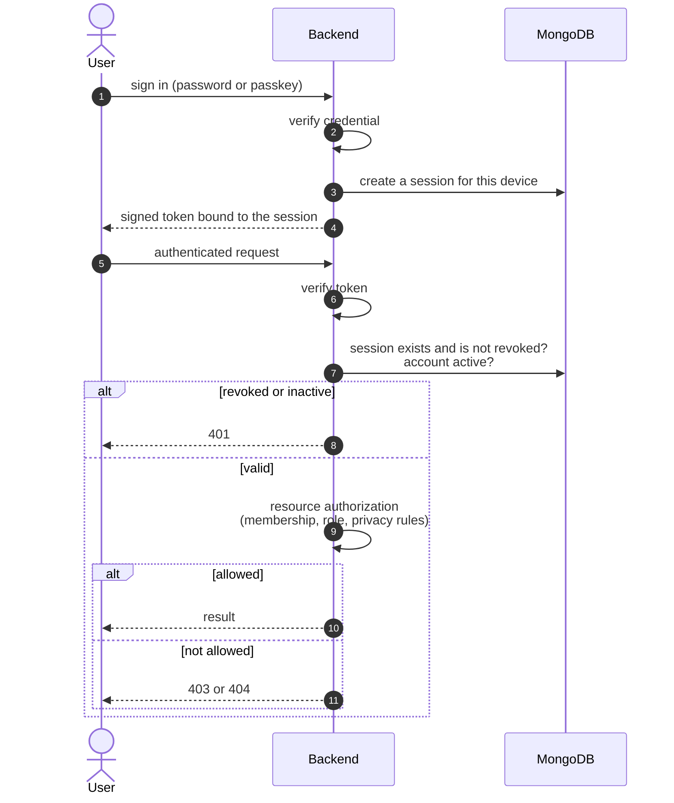
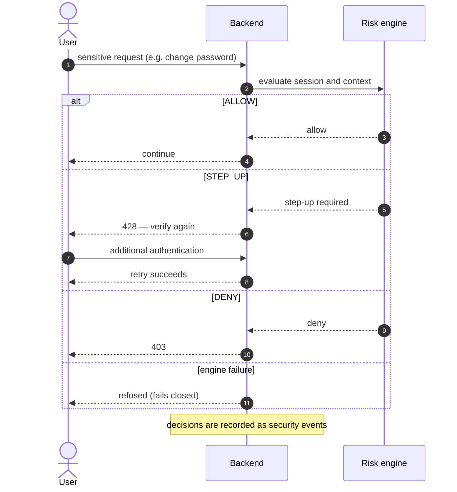
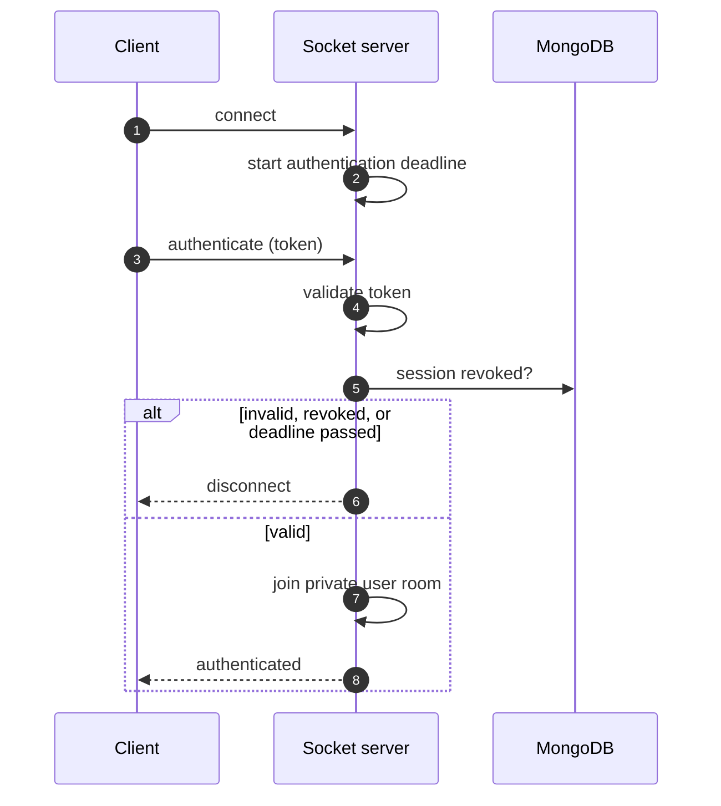
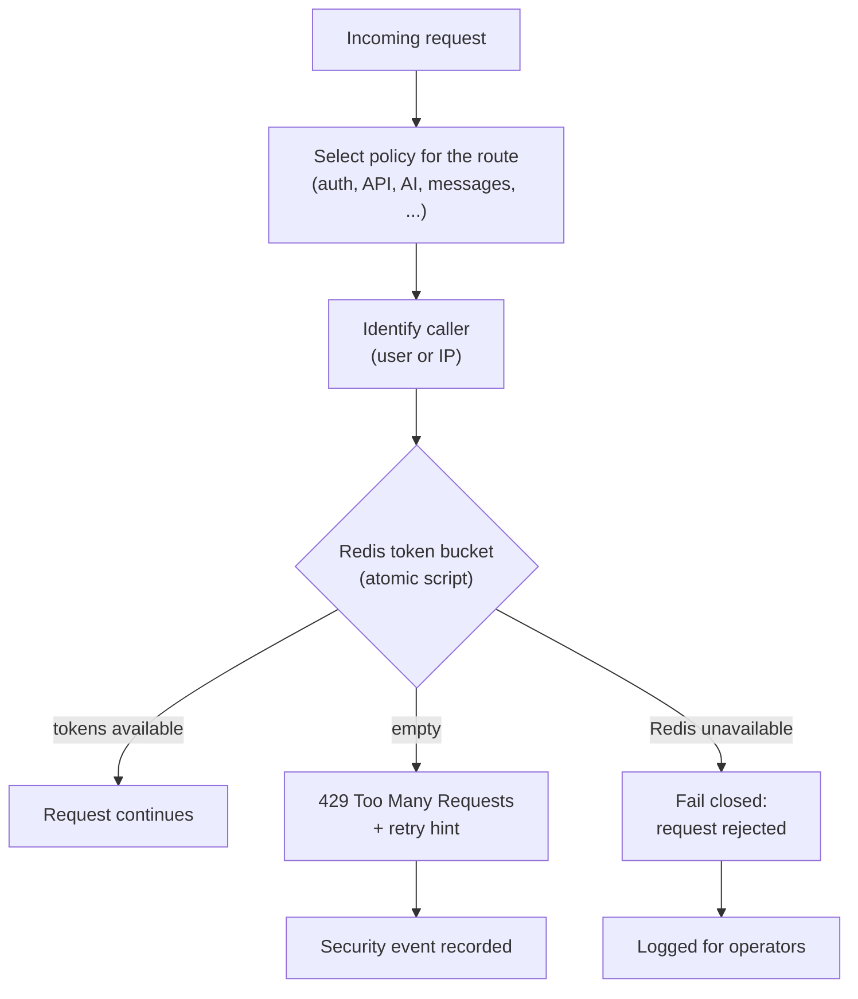
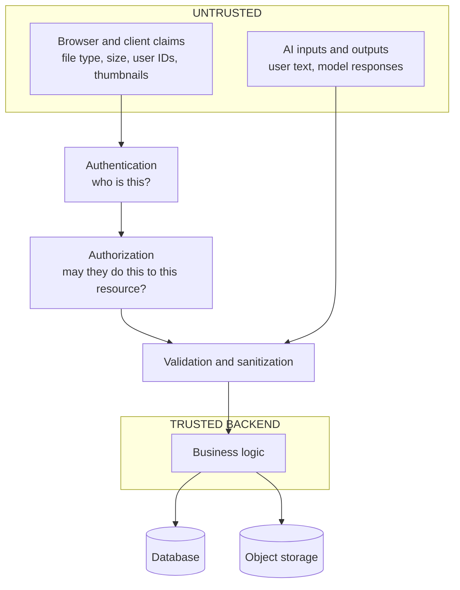

# Security Architecture

Conceptual view only. Operational and vulnerability details are kept in internal documentation.

## 4. Authentication and authorization

### HTTP requests

### Sensitive actions

### Socket connections

**Why this design?** Tokens alone cannot be revoked, so every request and every socket also checks a server-side session record; signing a device out takes effect immediately. Sensitive actions go through a separate risk decision rather than a flat role check, and authorization is evaluated per resource rather than assumed from the token.

---

## 5. Rate limiting

Because the counters live in Redis and are updated atomically, the limit applies across every backend instance, unlike a per-process in-memory limiter. It also means a Redis outage rejects traffic instead of silently removing protection.

Scale claims: none. The limiter's behaviour is covered by tests; no multi-instance benchmark of it has been published.

**Why this design?** Fail-closed trades availability for safety during a Redis outage, which is the right default for authentication and AI endpoints, where unlimited traffic is worse than a short interruption.

---

## 19. Trust boundaries

| Input | Treatment |
|---|---|
| Upload metadata (type, size, name) | Never trusted; derived from policy and re-verified against the stored object |
| Client-supplied identifiers and ownership claims | Ownership checked against the authenticated user on the server |
| Thumbnail / poster references | Validated against what that user actually uploaded |
| AI input and model output | Treated as untrusted text: bounded in size, output validated, user-specific access checks before any conversation text is gathered |
| Transport | HTTPS / WSS. Zeph is **not** end-to-end encrypted |

**Why this design?** Every check that matters is made on the server, after authentication, against server-side state. The client is a convenience layer, not a security boundary.
