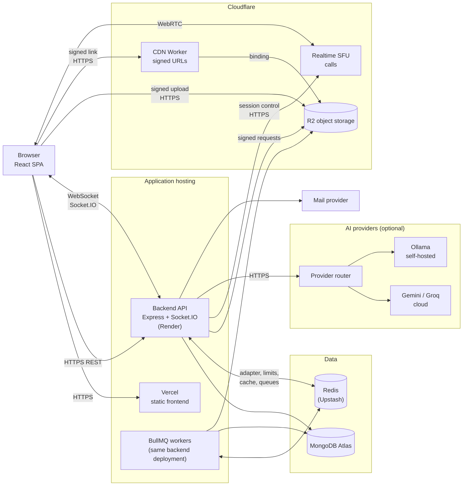
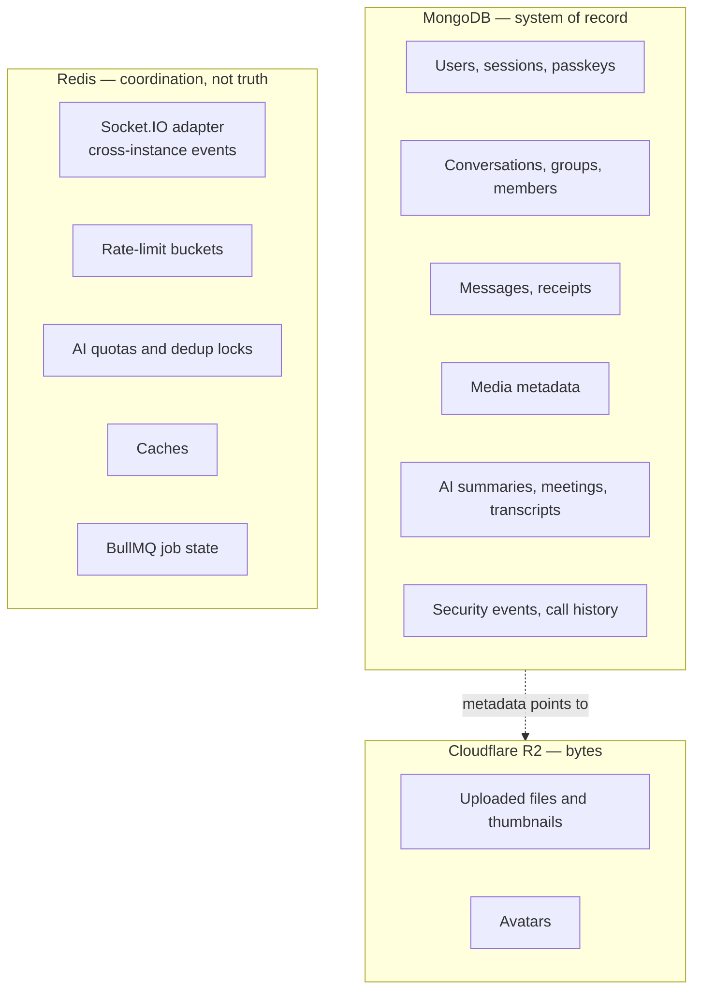

# System Overview

High-level view of the production components and what each one is responsible for. Every node below is a service Zeph actually uses today.

## 1. System architecture

**Legend**

| Arrow | Meaning |
|---|---|
| HTTPS REST | Request/response API calls (auth, messages, uploads, AI) |
| WebSocket / Socket.IO | Realtime events pushed to the browser |
| signed upload / signed link | Browser talks to storage or the CDN Worker using short-lived, server-signed requests; it never holds storage credentials |
| WebRTC | Call media flows between the browser and the Cloudflare SFU; Zeph's backend only controls sessions |
| adapter, limits, cache, queues | The four jobs Redis does (see diagram 14) |

**Not shown because it is not active / not implemented:** end-to-end encryption (design only), edge caching of media (needs the domain on Cloudflare DNS), and the self-hosted mediasoup call engine (an alternative behind a switch, not the production path).

**Why this design?** The API server is kept off the hot path for heavy bytes: uploads go straight to object storage and downloads come through a Worker, so the application server's bandwidth and memory are spent on authorization and business logic. Redis holds only coordination state, never the authoritative record. Optional services (AI, mail, object storage) degrade cleanly when unconfigured, so the core chat product has few hard dependencies.

---

## 14. Data responsibilities

| System | Authoritative for | Loss impact |
|---|---|---|
| MongoDB | All durable application data | Data loss (backups are a planned improvement) |
| Redis | Nothing durable: counters, locks, queue state, cache, adapter pub/sub | Rate limiting denies requests (fails closed); queued jobs wait; sockets fall back to single-instance behaviour |
| R2 | The file bytes only | Media unavailable; metadata remains in MongoDB |

**Why this design?** Keeping a single system of record (MongoDB) makes consistency simple: Redis can be flushed or lost without losing a message, and a media file's lifecycle is driven by its MongoDB record.
