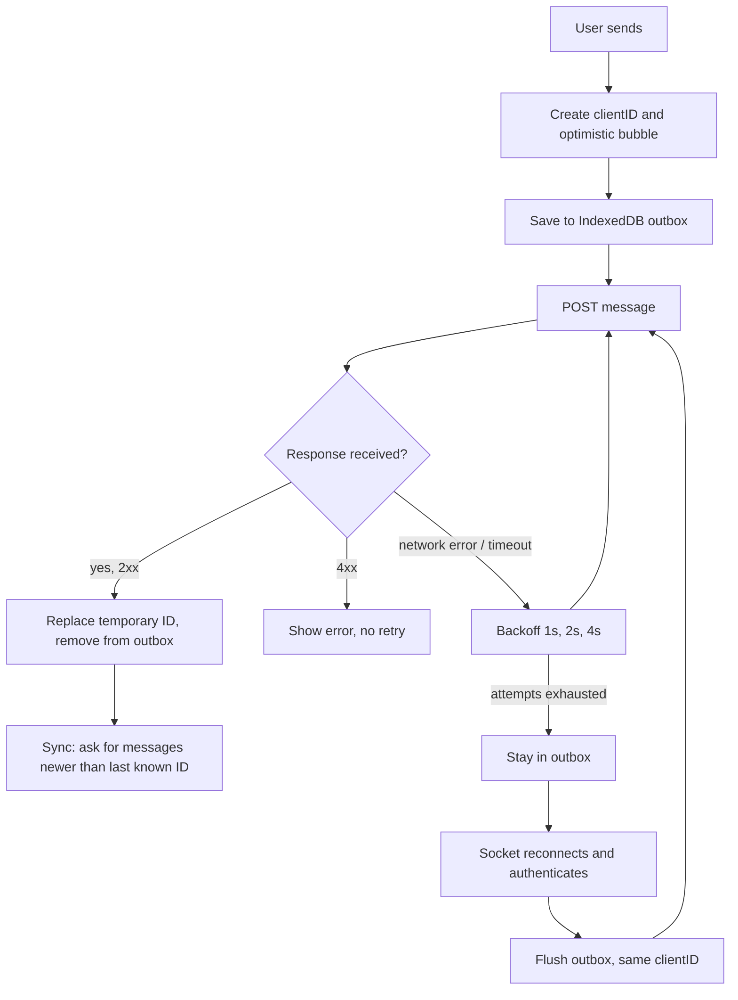
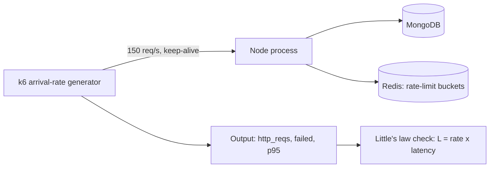
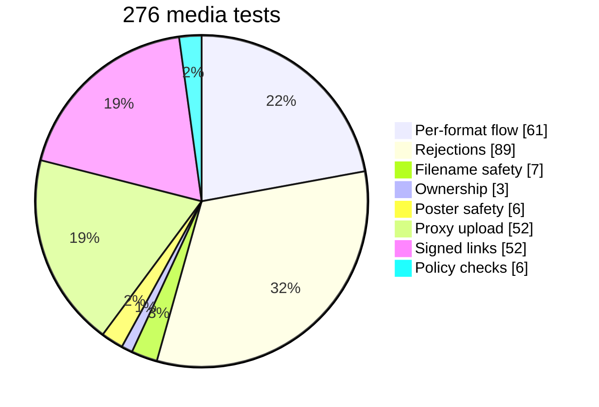
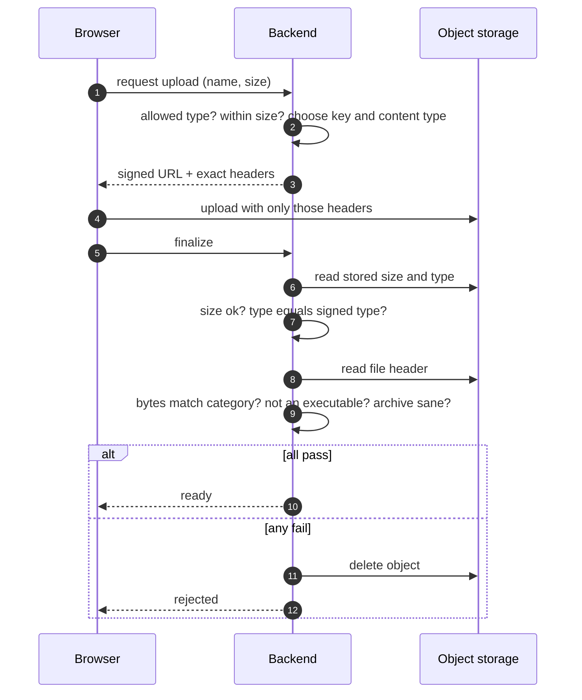
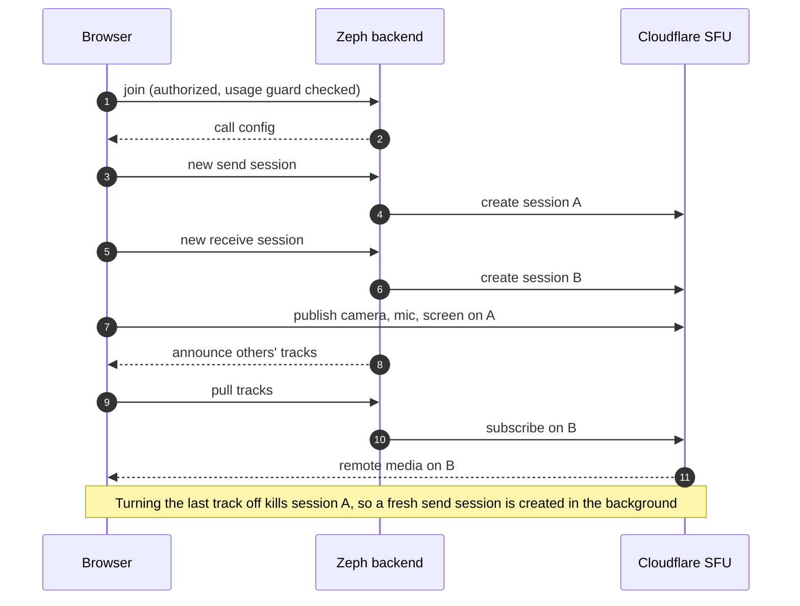
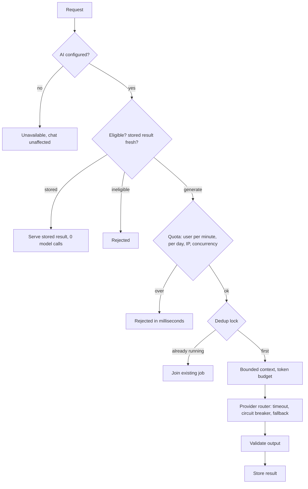
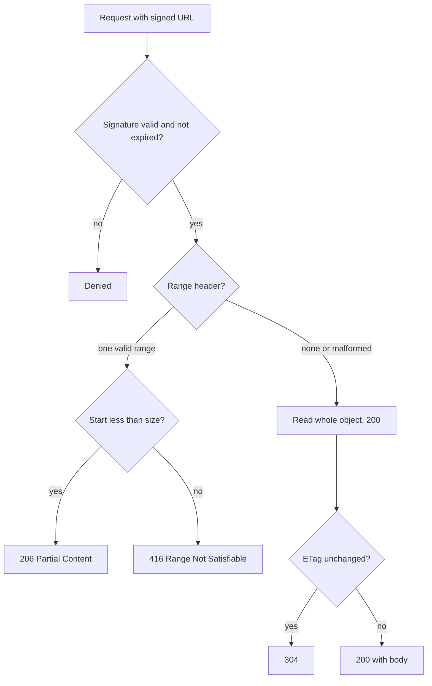
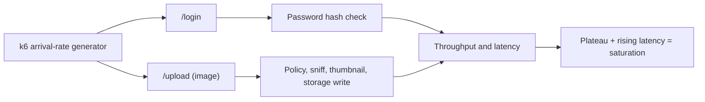

# Zeph: Resume Evidence Pack

How every number in the Zeph resume section was produced, with the arithmetic, the flow behind it, what it does and does not prove, and the interview questions it invites. Nothing here is a production result.

- Measured values are quoted from raw tool output (k6, Jest, MongoDB `explain()`), or from the project docs where noted.
- Maths is shown so each figure can be re-derived by hand.
- Security items are described by concept only; exploit details are intentionally not recorded here.

## Contents
1. [Metric register](#1-metric-register)
2. [Corrections to the resume wording](#2-corrections-to-the-resume-wording)
3. [Bullet 1: Idempotent messaging and load](#3-bullet-1-idempotent-messaging-and-load)
4. [Bullet 2: Security and secure uploads](#4-bullet-2-security-and-secure-uploads)
5. [Bullet 3: Calls on Cloudflare Realtime](#5-bullet-3-calls-on-cloudflare-realtime)
6. [Bullet 4: Governed AI gateway](#6-bullet-4-governed-ai-gateway)
7. [Bullet 5: Index, Worker delivery, throughput](#7-bullet-5-index-worker-delivery-throughput)
8. [How to reproduce](#8-how-to-reproduce)
9. [Interview questions](#9-interview-questions-for-senior--higher-package-roles)

---

## 1. Metric register

| # | Resume metric | Value | Source | Type | Strength |
|---|---|---|---|---|---|
| 1 | Message sends sustained | 150 /s, p95 13 ms, 0 failures | k6, 2026-10-09 | Measured by me, local, limits relaxed | High |
| 2 | Supported extensions | 52 | `mediaPolicy.js` | Counted from code | High |
| 3 | Matrix tests | 276 of 276 passing | Jest, 2026-10-09 | Measured by me | Medium (verification, not performance) |
| 4 | Call tracks | 4 participants × 3 tracks | `docs/CALL-FIXES-LOG.md`, live Cloudflare | Existing project measurement | Medium (synthetic video) |
| 5 | Camera/mic/screen cycles | 9 of 9 | same | Existing | Medium |
| 6 | Video quality | 640×360 (~190 kbps) → 1280×720 (~650 kbps) | `docs/CALL-QUALITY-METRICS.md` | Existing | Medium |
| 7 | AI de-duplication | 10 identical requests → 1 model call (90% fewer) | `docs/ZEPH-AI-ARCHITECTURE.md` | Existing, mock model | Medium |
| 8 | Over-quota rejection | 6–16 ms, no model call | same | Existing, mock model | Medium |
| 9 | Documents examined | 3,005 → 1 | `docs/PHASE8-CAPACITY-REPORT.md` | Existing, `explain()` | High |
| 10 | Login throughput | ~33 /s plateau | k6 + Node script | Measured by me, two tools agree | High |
| 11 | Image uploads | 37 /s, 0 failures | k6, 2026-10-09 | Measured by me, tiny test file | Medium |

## 2. Corrections to the resume wording

Found while building this document. Apply them before sending the resume.

1. **"56 extensions" is wrong; it is 52.** `mediaPolicy.js` defines image 5 + video 3 + audio 7 + pdf 1 + document 12 + archive 5 + text 19 = 52 (all unique, and 52 entries in the MIME table). An earlier summary said 56 and it was repeated by mistake. Use **52**.
2. **"~660 kbps" slightly overstates; the three samples average ~647 kbps.** Use **~650 kbps**.
3. **"9/9 cycles" and "4 participants × 3 tracks" are two different tests** (see section 5). Do not merge them into one claim.
4. **Do not cite 500/500 sockets.** It came from a Node client; a simultaneous k6 burst of 500 authenticated only 304 (section 3).

---

## 3. Bullet 1: Idempotent messaging and load

> Engineered idempotent messaging for unreliable networks: client IDs enforced by a MongoDB unique index, a durable IndexedDB outbox with backoff retry, reconnect resync, and a Redis-adapter Socket.IO setup. k6 load test (limits relaxed, one local process): 150 sends/s sustained at p95 13 ms, 0 failures.

### 3.1 What was built

| Piece | Where | Purpose |
|---|---|---|
| Client-generated `clientID` | frontend send path | Names a message before the server sees it |
| Unique partial index `{room, author, clientID}` | `backend/src/models/Message.js` | Makes a repeated insert a no-op |
| Duplicate-key path returns the stored message | `backend/src/routes/message.js` | Retry gets the same answer as the first try |
| IndexedDB outbox | `frontend/src/lib/outboxDb.js` | Survives tab close and offline |
| Exponential backoff | `frontend/src/lib/retryWithBackoff.js` | 1 s, 2 s, 4 s between attempts |
| Resync | `backend/src/routes/sync-messages.js` | Fetch messages newer than the last known one (bounded batch) |
| Redis adapter | `backend/src/setupRedisAdapter.js` | Cross-instance socket events |

### 3.2 Why duplicates cannot be stored

Let a message be uniquely named by `k = (room, author, clientID)`. The index forbids two documents with the same `k`. Every failure mode collapses to at most one stored row:

| Failure | What happens | Rows stored |
|---|---|---|
| Request lost before reaching the server | Retry arrives with the same `k` and inserts | 1 |
| Server commits, response lost | Retry hits the unique index, server returns the existing row | 1 |
| Double tap or two tabs | Second insert rejected, existing row returned | 1 |
| Network flaps repeatedly | n retries with the same `k` | 1 |

So for any number of attempts `n ≥ 1`, stored rows `≤ 1`. This is idempotent persistence. It is **not** exactly-once delivery: a recipient can still receive an event twice, and the client de-duplicates by ID.



### 3.3 The load-test metric: arithmetic

k6 scenario `constant-arrival-rate`, target 150 requests/s for 15 s, `POST /api/message`, one distinct seeded sender per room, rate limits raised.

| Quantity | Calculation | Result |
|---|---|---|
| Expected requests | 150 /s × 15 s | 2,250 |
| Observed requests | k6 `http_reqs` | 2,251 (+1 from interval edge) |
| Achieved rate | 2,251 ÷ 15.016 s | 149.90 /s |
| Failure rate | 0 ÷ 2,251 | 0.00% |
| Median / p95 / p99 / max | k6 `http_req_duration` | 10.94 / 12.73 / 27.48 / 45.92 ms |
| Resume figure "p95 13 ms" | round(12.73) | 13 ms |

**Little's law** (average in flight = rate × latency): `L = λW = 150 × 0.01094 s ≈ 1.6` requests in flight on average. The server was keeping up with almost nothing queued.

### 3.4 Finding the knee

Same test, higher targets. "Dropped" is k6 iterations it could not start because virtual users were all busy.

| Target /s | Completed | Dropped | Check (completed + dropped) | Achieved /s | Median |
|---|---|---|---|---|---|
| 100 | 1,501 | 0 | 1,500 expected | 99.9 | 10.1 ms |
| 150 | 2,251 | 0 | 2,250 expected | 149.9 | 10.9 ms |
| 200 | 2,884 | 116 | 3,000 = 200 × 15 | 175.0 | 1.37 s |
| 300 | 3,757 | 744 | 4,501 ≈ 4,500 | 219.0 | 2.45 s |

At the 200 target the achieved rate is 175 /s (87.5% of target), and by Little's law `L = 175 × 1.37 ≈ 240` requests in flight: a queue. The knee on this machine is between 150 and 200 requests/s, and the largest rate observed was ~219 /s. The earlier Node-script burst implied ~240 /s (2,000 requests in ≈ 8.3 s), consistent with a saturated single process.



### 3.5 What it proves, and what it does not

- Proves: one local Node process, limits relaxed, handled 150 sends/s with 0 failures and p95 ≈ 13 ms.
- Does **not** prove: production capacity, behaviour with real users, multi-instance fan-out (Redis adapter was not load tested; only one process ran), or anything with the rate limiter at default settings (default limits reject most of this load by design).
- Burst caveat: when k6 fired 500 brand-new connections in the same instant, 332 of 500 succeeded (66.4%); 168 (33.6%) were refused by the operating system's listen queue before the app saw them. A steady rate over reused connections is the representative test.

---

## 4. Bullet 2: Security and secure uploads

> Built a layered security model: session revocation on HTTP and sockets, passkey/WebAuthn login with PIN vault, fail-closed Zero Trust step-up, group RBAC, Redis token-bucket rate limiting; fixed a NoSQL injection, a socket DoS and a thumbnail IDOR. Hardened uploads with signed R2 PUTs and magic-byte/archive checks (52 extensions, 276/276 matrix tests).

### 4.1 Layers and the threat each addresses

| Layer | Threat addressed |
|---|---|
| Server-side session revocation, checked on HTTP and on sockets | A stolen or old token stays valid after sign-out |
| Passkeys (WebAuthn), PIN/passkey vault | Phishable passwords; shoulder access to hidden chats |
| Zero Trust step-up (allow / step-up / deny, fails closed) | Sensitive actions from risky sessions |
| Group RBAC, admin privacy boundary, media access via conversation membership | Privilege escalation, IDOR on messages and files |
| Redis token-bucket rate limiting (fails closed) | Brute force and abuse |
| Signed uploads + server-side validation | Hostile or mislabelled files |

### 4.2 The 52 and the 276: arithmetic

Extensions by category, from `MEDIA_CATEGORIES`:

| Category | Count |
|---|---|
| image | 5 |
| video | 3 |
| audio | 7 |
| pdf | 1 |
| document | 12 |
| archive | 5 |
| text | 19 |
| **Total** | **5+3+7+1+12+5+19 = 52** |

The 276 tests, from Jest's per-describe result:

| Group | Tests | How the count arises |
|---|---|---|
| Presign → upload → finalize per format | 61 | 52 extensions + 7 real-world variants + 2 special cases |
| Rejections | 89 | 52 executable-bytes + 16 unsupported types + 1 no-extension + 7 over-size at presign + 3 invalid sizes + 7 over-size at finalize + 3 (type mismatch, missing object, unauthenticated) |
| Filenames can't affect keys/headers | 7 | 6 hostile names + 1 |
| Ownership and replay | 3 | other user, double finalize, per-user folder |
| Poster/thumbnail cannot reach other objects | 6 | valid, forged key, non-image, oversize, failed video, non-video |
| Proxy upload ignores the claimed type | 52 | one per extension |
| Signed links carry the right type and disposition | 52 | one per extension |
| Policy consistency | 6 | MIME in category, no duplicates, drift check, etc. |
| **Total** | **276** | 61+89+7+3+6+52+52+6 |



### 4.3 Upload validation flow



### 4.4 The three fixes (high level)

| Fix | Class | Outcome |
|---|---|---|
| Unvalidated input used in a database query in an auth flow | NoSQL injection | Input is now constrained before it reaches the query |
| A malformed socket event could take the process down | Denial of service | Event input is validated; the handler cannot crash the server |
| A client-supplied thumbnail reference could point at someone else's object | IDOR | The reference is derived server-side and validated against the uploader's own object |

### 4.5 Limits

Not claimed: end-to-end encryption (not implemented), a third-party penetration test, or that no other issues exist. Tests show the checks work for the cases listed.

---

## 5. Bullet 3: Calls on Cloudflare Realtime

> Re-platformed calling onto the Cloudflare Realtime SFU behind a runtime switch (mediasoup retained); split send/receive sessions fixed missing video and screen share, and a usage guard bounds cost. Live test (synthetic video): 4 participants × 3 tracks, 9/9 cycles, 640×360 (~190 kbps) → 1280×720 (~650 kbps).

### 5.1 Two different "9" figures

| Claim | Test | Arithmetic |
|---|---|---|
| "4 participants × 3 tracks" | Everyone publishes audio, camera and screen at once; everyone pulls everyone | 4 × 3 = 12 published tracks. One viewer receives 3 other people × 3 tracks = **9** remote tracks (documented as "9 of 9 tracks flowing"). Across all viewers: 4 × 9 = 36 subscriptions |
| "9/9 cycles" | Turn mic, camera and screen off and on three times each | 3 features × 3 cycles = **9** |

The first value is my arithmetic reconstruction of the harness's "9 of 9"; confirm with `node loadtest/call-quality/multi3.cjs` before quoting it as "per viewer".

### 5.2 Video quality maths

| Quantity | Calculation | Value |
|---|---|---|
| Pixels, old | 640 × 360 | 230,400 |
| Pixels, new | 1280 × 720 | 921,600 |
| Pixel ratio | 921,600 ÷ 230,400 | 4.00× |
| Old bitrate samples | 190, 191, 193 kbps | mean 191.3 |
| New bitrate samples | 664, 637, 639 kbps | mean 646.7 |
| Bitrate ratio | 646.7 ÷ 191.3 | 3.38× |
| Bits per pixel per frame, old (20 fps) | 191,300 ÷ (230,400 × 20) | 0.0415 |
| Bits per pixel per frame, new (20 fps) | 646,700 ÷ (921,600 × 20) | 0.0351 |
| Change | 0.0351 ÷ 0.0415 | 0.85 (15% fewer bits per pixel) |

Bitrate grew 3.4× while pixels grew 4×. Bitrate does **not** scale linearly with resolution, which is why the resume states both values side by side and does not claim causation. The quality change needed two changes together: higher caps and a start-bitrate hint (neither alone lifted the video).

### 5.3 Egress cost arithmetic

| Quantity | Calculation | Value |
|---|---|---|
| Per stream at the 1.5 Mbps cap | 1,500,000 × 3,600 ÷ 8 | 675 MB = 0.675 GB/hour |
| Per stream measured (~0.65 Mbps) | 650,000 × 3,600 ÷ 8 | 292.5 MB ≈ 0.29 GB/hour |
| Streams received per person in a 4-person call | 3 | |
| Per participant-hour at the cap | 3 × 0.675 | ≈ 2.0 GB |
| Guard: 25,000 participant-minutes | 25,000 ÷ 60 | 416.7 hours |
| Worst case in the guard | 416.7 × ≈ 2.0 GB | ≈ 830–845 GB |

This is below the free 1,000 GB/month allowance, which is why the guard is set where it is.

### 5.4 Why separate send and receive sessions



A single connection that both published and subscribed made the SFU answer a new send section on a connection that already held receive sections, which the browser rejected. Two connections removed the conflict.

### 5.5 Limits

Synthetic video, headless Chromium, one machine, single-digit runs. No two-real-device test. mediasoup is retained as a self-hosted option but is not reachable on the current host.

---

## 6. Bullet 4: Governed AI gateway

> Designed a governed AI gateway: Gemini→Groq/Ollama routing with circuit breakers, per-user/IP/global quotas, Redis de-duplication, token budgets and BullMQ jobs. Mock-model benchmark: 10 identical requests → 1 model call (90% fewer); over-quota requests rejected in 6–16 ms.

### 6.1 The pipeline



### 6.2 The dedup experiment: arithmetic

20 concurrent identical group-summary requests were sent; 10 tokens belonged to members, 10 did not.

| Outcome | Count | Reason |
|---|---|---|
| 202 accepted | 10 | members, all joined one job |
| 403 forbidden | 5 | non-members |
| 429 limited | 5 | the separate per-IP limiter |
| **Total** | **20** | 10 + 5 + 5 |

Server logs showed exactly one queued job, one provider call and one worker run. Model calls saved:

`saved = n − 1 = 10 − 1 = 9` of 10, so the reduction is `1 − 1/10 = 90%`.

General form: for `n` identical concurrent requests, calls fall from `n` to `1`, a reduction of `(n − 1) / n`. For n = 2 it is 50%, n = 5 is 80%, n = 10 is 90%. This is valid **only for identical concurrent requests**; it is not a general "AI usage reduced by 90%" claim.

### 6.3 Quota experiment

One user, 15 rapid requests, per-minute quota = 5:

| Quantity | Calculation | Value |
|---|---|---|
| Served | first 5 | 5 of 15 = 33.3% |
| Rejected | 15 − 5 | 10 of 15 = 66.7% |
| Served latency | simulated provider round trip | ≈ 325–535 ms |
| Rejected latency | no provider call | ≈ 6–16 ms |
| Reject speed-up | 325 ÷ 16 to 535 ÷ 6 | ≈ 20× to 90× faster to reject than to serve |

### 6.4 Other measured facts

| Fact | Value |
|---|---|
| Repeat reads of an already-summarized chat | 20 requests, 0 model calls (100% from stored summary), p50 59.7 ms, p95 102 ms |
| 500-message room, estimated input | ≈ 4,019 tokens against a 4,000 budget (the estimator is characters ÷ 4, so a small overshoot is expected) |

### 6.5 Limits

The provider was a **mock** with a fixed 300 ms delay, so latency here says nothing about Gemini or Groq. Prompt-injection defences are limited, and cloud providers receive conversation text; Ollama keeps it local.

---

## 7. Bullet 5: Index, Worker delivery, throughput

> Optimized data and delivery: an index cut a user-level query from 3,005 documents examined to 1 (local), and a signed-URL Cloudflare Worker over private R2 (Range, 304, forced downloads) keeps files off the API server. k6: ~33 logins/s and 37 image uploads/s with 0 failures, indicating CPU-bound hashing.

### 7.1 The index

The inbox load runs `User.find({ level: { $ne: 'standard' } })` to find privileged users. Before the index, MongoDB's `explain()` showed a full collection scan; after `UserSchema.index({ level: 1 })` it showed an index scan.

| Quantity | Calculation | Value |
|---|---|---|
| Documents examined, before | seeded users | 3,005 |
| Documents examined, after | privileged users only | 1 |
| Reduction factor | 3,005 ÷ 1 | 3,005× |
| Reduction | (3,005 − 1) ÷ 3,005 | 99.97% |

Only **documents examined** was measured. The resume does not claim latency improved by 99.97%, because latency was not measured for this query. A plain index (not a partial one) was used because MongoDB partial-index expressions do not support `$ne`.

### 7.2 Worker range logic: worked example

For a 10-byte object:

| Request | Rule | Response |
|---|---|---|
| `bytes=-3` | suffix: last 3 bytes → start = 10 − 3 = 7, end = 9 | 206, `bytes 7-9/10` |
| `bytes=7-` | open ended: start 7 to the end | 206, `bytes 7-9/10` |
| `bytes=500-` | start 500 ≥ size 10: unsatisfiable | 416, `bytes */10` |
| `bytes=abc`, `bytes=0-1,5-6` | malformed or multiple ranges | ignored, 200 with the whole object |
| `If-None-Match` equals the ETag | unchanged | 304 |



Download-only types (documents, archives, text) are always served as attachments, never rendered inline. Edge caching is **not** active yet.

### 7.3 k6 throughput

| Test | Target | Achieved | Failed | Median | p95 | Little's law `L = λW` |
|---|---|---|---|---|---|---|
| Login | 20 /s | 22.2 /s | 0% | 46 ms | 209 ms | 22.2 × 0.046 ≈ 1 |
| Login | 30 /s | 30.5 /s | 0% | 76 ms | 203 ms | ≈ 2.3 |
| Login | 40 /s | 32.9 /s | 0% | 1.44 s | 2.93 s | 32.9 × 1.44 ≈ 47 (queue) |
| Image upload | 40 /s | 37.2 /s | 0 of 601 | 891 ms | 1.14 s | 37.2 × 0.891 ≈ 33 |

**Why "indicating CPU-bound":** between targets of 30 and 40 /s, achieved logins stopped rising (30.5 → 32.9 /s) while median latency jumped from 76 ms to 1.44 s. A ceiling that does not move with offered load, plus a growing queue, is the signature of a saturated resource. Password hashing is deliberately expensive, so it is the likely culprit, but **no profiler was run**, which is why the resume says "indicating" and not "showing".

Image uploads did not saturate at 40 /s on a test image under 1 KB, so 37 /s is a floor, not a maximum, and says nothing about bandwidth.



---

## 8. How to reproduce

Always against a local throwaway MongoDB and Redis, never shared services. Full setup is in `backend/loadtest/README.md` and `docs/LOAD-TEST-RESULTS.md`.

```bash
# Metric 1, 10, 11: k6 steady rate (from backend/)
k6 run -e SCENARIO=messages -e RATE=150 -e VUS=800 -e ROOMS=rooms.json loadtest/k6/burst.js
k6 run -e SCENARIO=login    -e RATE=30  -e VUS=100 loadtest/k6/burst.js
k6 run -e SCENARIO=upload   -e RATE=40  -e VUS=400 -e USERS=users.json -e PNG=photo.png loadtest/k6/burst.js

# Metrics 2, 3: media matrix
cd backend && npx jest test/media-formats.test.js

# Metric 6: call quality (needs Cloudflare credentials; temporary Playwright)
node loadtest/call-quality/quality.cjs

# Metric 9: index (mongosh)
db.users.find({ level: { $ne: 'standard' } }).explain('executionStats')
```

---

## 9. Interview questions for senior / higher-package roles

Answer points are starting notes, not scripts. Be ready to say what you did not measure.

### Messaging and realtime

**1. Why persist messages over HTTP and use the socket only for delivery?**
- Durable state and live propagation fail differently; HTTP gives status codes, retries and a place for the unique constraint.
- Socket acks do not survive reconnects or multiple tabs; the DB constraint does.
- Trade-off: one more request path, and sends are not a socket round trip.

**2. A user sends the same message twice at the same instant from two tabs. What is stored, and what does each tab see?**
- One row (unique on room, author, clientID); the second insert returns the existing message.
- Both tabs reconcile to the same server ID.

**3. Can messages arrive out of order? How would you guarantee order?**
- Order here follows database IDs, which are not strictly monotonic across instances or clocks.
- Fix: a per-conversation sequence number allocated atomically, then sort and gap-detect on the client.

**4. How does the Redis adapter work, and what are its limits?**
- Pub/sub relays events between instances; it stores no history and is at-most-once.
- A missed event is repaired by the resync call, not by the adapter.
- Presence is per process today, so presence would be wrong across instances.

**5. What happens when the client reconnects after a long outage?**
- Re-authenticate, flush the outbox with the same IDs, then fetch messages newer than the last known one in bounded batches.
- Follow-up: what if the gap exceeds the batch size? Loop until empty.

### Security

**6. JWT plus server-side session revocation: why not purely stateless tokens?**
- Stateless tokens cannot be revoked; a per-request session lookup trades a database read for instant sign-out.
- Better long-term: short-lived access tokens with refresh rotation; today's tokens live much longer, and I should say so.

**7. Walk through your rate limiter. Why fail closed?**
- Token bucket in Redis, updated by a single atomic script using Redis's clock, keyed by user or IP, with named policies.
- Fail closed: a Redis outage must not mean unlimited traffic on login and AI; the cost is reduced availability, which I accept for those routes.
- Follow-ups: shared NAT fairness, trusted proxy hops for the client IP.

**8. How can an uploaded file be trusted? What are the remaining risks?**
- It is not: the server picks the key and content type, binds headers into the signature, re-checks real stored size and bytes, rejects executables, inspects archives, and deletes failures.
- Residual: content sniffing is heuristic; polyglot files; a gap between check and later use. Download-only types are never rendered inline.

**9. Signed URLs: what can go wrong?**
- They are bearer links: anyone with the URL can use it until expiry; they can leak through logs or referrers, and cannot be revoked early.
- Mitigations: short expiry, per-media authorization before issuing, a signing-key rotation plan.

**10. What is your biggest remaining security gap?**
- No end-to-end encryption (design only); server can read message content.
- Plus token lifecycle hardening and wider prompt-injection defences. State these plainly; do not oversell.

### Performance and scale

**11. You report 150 sends/s. How was it measured, and why should I trust it?**
- k6 steady arrival rate, same endpoint, 15 s, 2,251 requests, 0 failures, p95 12.7 ms; Little's law check shows ~1.6 in flight.
- Caveats: one laptop shared by generator and server, relaxed limits, not production.

**12. Why did a simultaneous burst fail when a steady rate passed?**
- Hundreds of new TCP connections in one instant overflow the OS listen queue before the app runs; steady rate reuses connections.
- Lesson: choose the load model that matches real traffic (open vs closed model).

**13. Where is the bottleneck, and how would you prove it?**
- Throughput plateaus while latency climbs, so a resource is saturated; password hashing is the suspect for login.
- Prove it with a profiler or event-loop-lag and CPU measurements; I have not done that, so I say "indicating".

**14. Take this to 100× the load. What changes first?**
- Run more stateless API instances behind a load balancer with sticky sessions or a pure-websocket tier; Redis adapter for fan-out.
- Split workers from the API, move presence to Redis, add a per-conversation sequence, review MongoDB indexes and consider sharding by conversation.
- Move heavy bytes already off the server (direct uploads, Worker delivery).

**15. You cut documents examined from 3,005 to 1. Did latency improve?**
- I measured documents examined, not latency, so I claim only that.
- Explain `explain()` stages (full scan vs index scan), why a plain index was used (partial indexes cannot express `$ne`), and index size trade-off.

### Reliability and data

**16. Deleting a media message: walk through the consistency story.**
- Detach the reference first, which stops serving immediately; a queued job deletes stored objects only if no other message references the media, with retries.
- Jobs are at-least-once, so deletion is idempotent; UI is optimistic with rollback on failure.

**17. What did chaos testing find?**
- Killing Redis crashed the process through an adapter error; fixed so it degrades and reconnects. MongoDB loss degraded readiness without a crash.
- Note the rate limiter now fails closed, so a Redis outage rejects traffic by design.

**18. How do you keep the AI feature from becoming a cost problem?**
- Explicit user action, eligibility rules, stored summaries, per-user/IP/global quotas, a dedup lock, a token budget, timeouts, a circuit breaker.
- Failure modes to discuss: lock expiry and thundering herd, stale summaries, quota atomicity under concurrency.
- Limit: benchmarks used a mock model, so real latency and cost are unmeasured.

### Calls and architecture

**19. Why an SFU and why Cloudflare? What does the usage guard protect?**
- SFU forwards each stream (client upload stays flat) versus mesh (N−1 uploads) or MCU (expensive mixing).
- The API host cannot expose a wide UDP range, so a managed SFU; the guard keeps egress inside the free allowance (≈ 830 GB worst case vs 1,000 GB).
- mediasoup stays as a self-hosted switchable option.

**20. This started from a commercial template. What is yours, and how can you prove it?**
- Be specific: the unique-index idempotency, outbox, Redis adapter, rate limiter, security phases, upload pipeline, AI gateway, Cloudflare calls, CDN Worker and tests are post-template; sockets authentication shape, pagination and password hashing came with it.
- Evidence: git history by file and date; be ready to explain any line, including parts written with AI assistance.

### Resume-side check questions

If asked "what does your 9/9 mean?", answer: nine camera/mic/screen off-and-on cycles (3 × 3) delivered media in a live test; separately, a four-person call with everyone publishing three tracks. If asked "why 52?", answer with the category counts in section 4.2.
